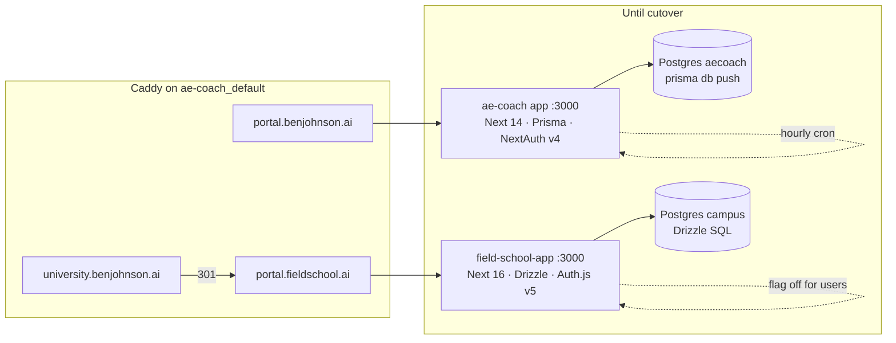
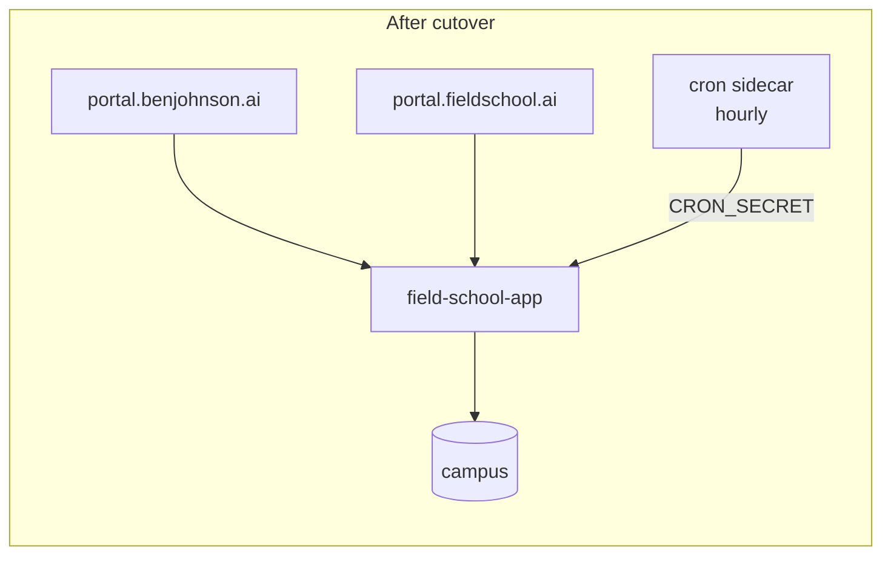
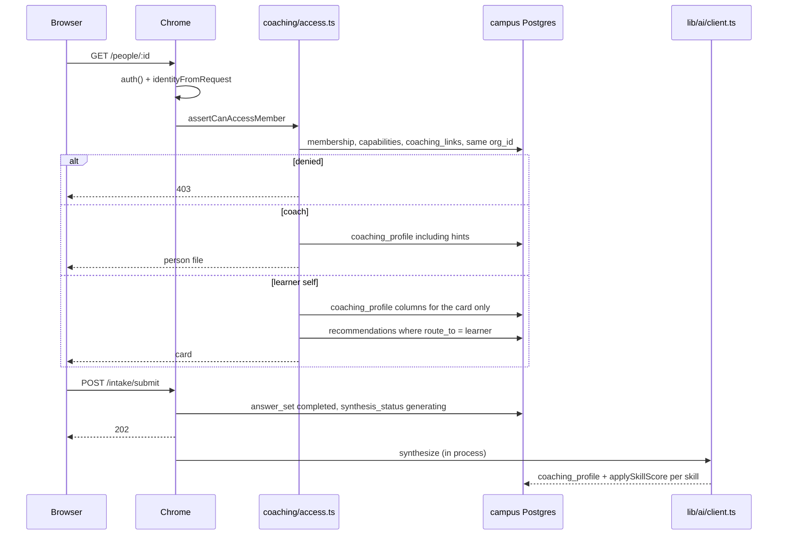

# AE Coach → Field School: coaching, learning, and teaching on one platform

| | |
|---|---|
| Author | Field School engineering (placeholder) |
| Date | 2026-09-23 |
| Status | Draft |
| Destination | `field-school/app` (Next.js 16.3, Drizzle, Auth.js v5, Postgres, Tailwind 4) |
| Behavior and UI source | `AE _ Director Coach` (product name in the UI: Sales Coach AI) |
| Repos | Implementation PRs land in `bjljohnson2012/field-school` under `app/`, except one write-freeze PR in `bjljohnson2012/ae-coach` |

This document is the migration and integration plan. It is a selection, not a wholesale port of AE Coach onto Field School. Ben prefers the design, UI, and UX of AE Coach to Field School. That preference covers the portal people use: layout, type, color, components, and how a screen moves, not only the nav bar after login. Keep the coaching loop and that interface. Keep the course ladder, tenants, events, and Field Pattern as behavior. The brochure at `fieldschool.ai` stays the Field School brand. Drop each product's worst mechanisms on purpose. The lists are in "What we keep and what we drop." It is not the GitHub push of the AE Coach tree, and it is not a claim about the contents of production Postgres. The live database `aecoach` was not inspected.

---

## Overview

AE Coach (`portal.benjohnson.ai`) is the working sales-coaching product: director workflows, intake, skill cards, tasks, reviews, knowledge, and the navy app shell Ben wants to keep. Field School (`portal.fieldschool.ai`, code in `/Users/Owner/field-school/app`) is the product home going forward: course ladder, guest catalog, household and sales tenants, learning events, stances, and Field Pattern `fp-50-v1`. The kept parts of both are required. The dropped parts are not. Two products is not an acceptable end state.

The plan is a strangle inside `field-school/app`. Bring the kept AE Coach behavior and the kept Field School behavior onto Next.js 16, Drizzle, and Auth.js v5. Map the kept rows into the campus schema. Do not carry Next.js 14, Prisma, or NextAuth v4 forward. Do not rebuild the catalog around the Grok Bot course. Dropped behavior is left behind. It is not ported and fixed later. AE Coach keeps serving `portal.benjohnson.ai` and stays the write path for coaching until a short freeze, a final import, and a Caddy upstream flip. Rollback is that upstream flip, not a schema merge.

Ben confirmed on 2026-09-23 that the point of the move is to gain what AE Coach does not finish: Field School editing, admin controls, tenant structure, reporting, and business intelligence. Editing means the campus content and admin surfaces that already exist, plus the coaching authoring screens in this plan. It is not a new editor. Reporting starts, after cutover, as the existing Analyze explorer pointed at `learning_events` and `skill_states`. Test-environment coaching rows are imported. They are not dropped because they were test data. Household data and the platform org are not deleted to make room.

The portal adopts the AE Coach interface. That is a hard constraint, and it is broader than a signed-in color swap. Navy shell, role nav, orange Tasks affordance, command palette, cards, skill tiles, wizard steps, drawers, form controls, density, and the tokens in `AE _ Director Coach/tailwind.config.ts` and `src/styles/globals.css` are the design system for login, the catalog, course stations, Field Pattern, and coaching. A guest does not see a cream marketing header that turns into a navy app after sign-in. The static brochure at `fieldschool.ai` stays cream, Fraunces, and the seal. That site is not the product. The portal is not reskinned back to shadcn cream.

Load is one operator, a handful of directors, tens of AEs, and one household org. The design target is 500 memberships and on the order of 50,000 `learning_events` a year. That fits one Postgres on the existing VPS (`2.24.70.248`). There is no multi-region work in this plan. There is tenancy isolation work, because household data and sales coaching data must not cross orgs, and director-only psychographic content must not show up in learner payloads.

The older TanStack Start tree at `field-school/src` (and the note in `field-school/archive/TANSTACK.md`) is not the destination. `docs/campus-runtime/01-current-state.md` already warns that GitHub `main` on the old tree is the wrong ship path. All new code goes in `field-school/app`.

---

## Background & Motivation

### What is live today

Both apps share a machine and a Docker network. They do not share a database or a UI.

| | AE Coach | Field School campus |
|---|---|---|
| URL | `https://portal.benjohnson.ai` | `https://portal.fieldschool.ai`. `university.benjohnson.ai` 301s there |
| Code | `/Users/Owner/AE _ Director Coach` | `/Users/Owner/field-school/app` |
| VPS path | `/opt/ae-coach` | `/opt/field-school` |
| Edge | Caddy, repo file `docker/Caddyfile` proxies `portal.benjohnson.ai` to service `app:3000`. Live file `/opt/ae-coach/docker/Caddyfile` is also what Field School deploy reads | Container `field-school-app` joins external network `ae-coach_default` (`app/deploy/docker-compose.yml`) |
| DB | Postgres 16, database `aecoach`, user `aecoach`. Schema applied by `npx prisma db push --accept-data-loss` in `docker-compose.yml`. No `prisma/migrations` directory | Postgres 16 + pgvector image, database `campus`, container `field-school-campus-db`, Drizzle schema in `app/src/lib/db/schema.ts`, SQL in `app/db/0001`–`0004` |
| Auth | NextAuth v4 credentials, bcryptjs cost 12 (`src/lib/auth.ts`) | Auth.js v5 (`next-auth` 5.0.0-beta.32). Google, X, and email/password. Passwords live in the JSON member store (`app/src/lib/members/store.ts`, bcrypt cost 12), not in Postgres. `roleForAuth` refuses to grant `admin` on the credentials provider (`app/src/lib/members/policy.ts`) |
| UI | Hand-rolled classes, Tailwind 3, Inter + Space Grotesk + IBM Plex Mono | Tailwind 4, shadcn, Fraunces + IBM Plex, cream paper. `SiteHeader` in the root layout (`app/src/app/layout.tsx`) |
| AI | One module, `src/lib/ai.ts`, OpenAI-compatible client against xAI. Synth model `resolveSynthModel`, fast model `MODEL_FAST` | One call site for speech, `app/src/lib/pattern/stt.ts` (`grok-stt` / audio transcriptions). No chat-completions module |

AE Coach cron is an Alpine sidecar in `docker-compose.yml`. The compose command POSTs `/api/cron/run-quiz-schedules` and GETs `/api/cron/run-weekly-briefs`. In this tree the quiz route exports `GET` and `export const POST = GET` (`src/app/api/cron/run-quiz-schedules/route.ts`), so that POST is not a 405. Weekly briefs exports `GET` only (`src/app/api/cron/run-weekly-briefs/route.ts`). Both handlers skip the bearer check when `CRON_SECRET` is unset (`if (expected)`). A public HEAD on 2026-09-23 to both paths returned prerendered 404s, so the compose file is not proof the live sidecar is succeeding. Field School has no equivalent sidecar. The replacement is one POST that fails closed. See the cron contract below.

`docs/CURRENT_STATE.md` (recorded 2026-09-23) is the inventory. `ARCHITECTURE.md` is still the best flow writeup, but its role table predates `COMPANY_ADMIN` and `VP_SALES`. `README.md` in that repo is stale and is not an input to this plan. `src/lib/tenancy.ts` is the live hierarchy: `ORG_ADMIN > COMPANY_ADMIN > VP_SALES > DIRECTOR > AE`.

### What each side already does

AE Coach, enforced in `src/lib/tenancy.ts` and in queries, not only in the shell:

- Invite, save/resume intake, server-side question intercalation (`src/lib/intercalate.ts`) so category labels never ship to the wizard client.
- Skill card, director override, monthly review with score deltas, compare.
- Coaching notes (`visibleToAe` default false), plans, 1:1 prep, tasks, ad-hoc and recurring quizzes, retakes, improve drills.
- Knowledge repos, products, file classify-and-map.
- Recommendations filtered on the AE card with `where: { routeTo: "AE", status: "OPEN" }` (`src/app/(app)/ae/card/page.tsx`). Notes on that page use `visibleToAe: true`. Personality and leadership recommendations are prompted to `DIRECTOR_ONLY` in `src/lib/ai.ts`.
- The subject's own skill card does render that subject's type chips and narrative (`src/components/SkillCard.tsx`). Leader-only fields are the separate hint and reasoning blobs on the profile (`coachingHintsJson`, `reasoningSummary` in `prisma/schema.prisma`).

Field School, actually in `app/src/lib/db/schema.ts` and the campus-runtime docs, not merely planned:

- Organizations `field-school` (operator), `household` (`kind=homeschool`, `isolation=strict`), `sales` (`kind=company`, `isolation=platform_plus`). See `app/db/0004_tenants.sql` and `app/src/lib/campus-runtime/org.ts`.
- One Auth.js user, many memberships, cookie `fs_org`. A child member cannot land on the sales slug (`pickActiveSlug`).
- Stances stored as one text column. Unique key is `(org_id, member_id)` — one row per person per org. Documented stance names: learner, teammate, teacher, trainer, coach, leader, guardian, admin (`docs/campus-runtime/02-destination-and-schema.md`).
- Learning-event spine: `org_id`, `membership_id`, `actor_membership_id`, `actor_stance`, `kind`, `object_type`, `object_id`, `skill_ids`, `score`, `raw`. Accepted kinds today: `watch`, `quiz`, `assignment`, `diagnostic` (`app/src/app/api/events/route.ts`). Course progress is a reducer over those rows (`app/src/lib/campus-runtime/events.ts`).
- Course ladder for `grok-bot`: watch, field work, quiz, exam (`app/src/lib/course/catalog.ts`, routes under `app/src/app/c/[courseSlug]/`). Guest catalog stays on local progress. Signed-in progress is Postgres.
- Fixture lessons `home:welcome` and `sales:welcome`. Org/course allow-list in `courseAllowedInOrg`.
- Field Pattern `fp-50-v1`: `instruments`, `instrument_items`, `instrument_runs`, `member_profiles`, `member_profile_revisions`. UI at `/pattern`. Chooser reads the profile and does not rewrite the pack (`app/src/lib/pattern/chooser.ts`).
- Org-scoped skills. Household seeds `morning`, `chores`, `read` on a 1–4 diagnostic. Sales seeds `discovery`, `qualification`, `next-step`. `POST /api/skills` upserts `skill_states` and writes a `diagnostic` event (`app/src/app/api/skills/route.ts`). Household names are parent-editable. Sales names are not.
- Wards (guardian/child), invites, groups, assignments, profile artifacts (paper / STT nudges into Bearing).
- Billing hooks (Stripe seats) and a staff `/admin` gate that is separate from tenant stance. `app/src/proxy.ts` only matches `/admin`.

`docs/campus-runtime/ASSESSMENTS_AND_PICKER.md` talks about `assessment_instruments`, `assessment_runs`, and `profile_snapshots`. Those names did not ship. The tables that exist are `instruments`, `instrument_runs`, and `member_profiles`. This plan uses the shipped names.

`docs/campus-runtime/02-destination-and-schema.md` lists later-wave tables that are **not** in the Drizzle schema today: `sources`, `knowledge_units`, `learner_models`, `work_items`, `runtime_courses`, packs, resource proposals. This plan adds only the subset coaching needs, under those names where the doc already reserved them. It does not pretend the rest exist, and it does not build the course composer, Remotion, or campus MCP.

### Pain

Directors cannot coach inside Field School. Learners cannot take the course ladder inside AE Coach. The two shells disagree, and Ben has already picked the coaching shell for the logged-in app. Running both UIs forever splits tenancy, duplicates people, and will leak personality content the first time someone joins the tables by email in an ad-hoc report.

A second framework fork (Prisma app kept alive beside Drizzle) recreates that split inside one repo. The AE Compose command `prisma db push --accept-data-loss` must never be pointed at the campus database.

---

## Goals & Non-Goals

### Goals

1. One logged-in product in `field-school/app`. Coaching, the course ladder, household teaching, and sales learning share one shell, one auth session, one Postgres, and one AI module.
2. Port what "What we keep and what we drop" keeps, and leave the drop list behind. Coaching behavior on the keep list is moved as it works today. It is not redesigned for its own sake. Dropped behavior is not ported and then repaired. Map the kept data. Do not map the dropped mechanisms.
3. Keep the course ladder (watch / field work / quiz), guest catalog, learning events, household org, sales org, stances, wards, and Field Pattern `fp-50-v1`.
4. Keep personality and psychographic **routing** director-only unless `routeTo` is the learner. Keep coaching notes hidden from the learner unless a coach opts in. Keep wizard category labels off the client.
5. Every skill-score change is a `learning_events` row plus a projection. No parallel score table that nothing else reads.
6. Household rows and sales rows are isolated by `org_id` on every new table, checked in one access module.
7. `portal.fieldschool.ai` keeps serving the campus through the whole build. `portal.benjohnson.ai` cuts over only after a freeze and a replayable import. Rollback does not require restoring a database backup as the first step.
8. A solo builder can land the work as a short sequence of reviewable PRs.
9. Keep AE Coach's coaching rows, including rows that were created in a test environment, and put them in Field School orgs without collapsing them into `sales`, `household`, or `field-school` unless Ben later supplies an explicit map. The existing sales org stays the sales-shaped tenant.
10. Give operators a reporting surface after cutover. The first one is the AE `/admin/analyze` explorer, org-scoped, reading `learning_events` and `skill_states`. That is the business-intelligence start. It is not a warehouse and not a new chart vendor, and it does not block the coaching cutover.

### Non-goals

- Multi-region, read replicas, Redis, a job queue, pgvector RAG, or a new embedding pipeline. The nullable embedding column can stay nullable JSON. The campus image is already `pgvector/pgvector:pg16`; enabling the extension is later.
- Rebuilding the video factory (Cap, edit, melt), Notion publish, campus MCP, wildcard DNS, or Remotion plates.
- Replacing `fp-50-v1` with Enneagram, DISC, or MBTI items. Do not copy proprietary instrument text. Imported type **labels** that AE Coach already stores are data, not a new scored instrument.
- Carrying per-org SMTP passwords. `CompanyProfile.smtpPass` is plaintext in the AE schema comment. Do not import it. Mail goes through the existing Field School Resend/SMTP env on the host. No secret values belong in this document or in git.
- Reskinning the public brochure (`field-school/app/marketing-site`, `fieldschool.ai`) into the navy shell. The portal is not that site. Login and the catalog inside the portal do get the AE Coach interface.
- Deploying or extending `field-school/src` (TanStack).
- Designing for unknown future customers beyond the tenancy rules. No new customer names are assumed.
- Dual-writing coaching rows to both databases during the build.
- A new data warehouse, a new chart vendor, or a full BI product. Reporting is a goal. The non-goal is a second analytics stack. The first surface is PR 21.
- Retiring `/c/grok-bot`. Ben said on 2026-09-23 that the Grok Bot course will be removed. That removal is a separate Field School change. This migration does not add `grok-bot` to the sales allow-list, does not link the shell to it, and does not rebuild the catalog around it.

---

## What we keep and what we drop

Ben's instruction on 2026-09-23: take the best of each product and lose the worst of each. This is not "port AE Coach wholesale." A behavior on the drop list is not built, not imported as a mechanism, and not scheduled as a later repair. Coaching behavior on the keep list is still ported as it works. Earlier decisions stay: import each AE org without guessing a merge into `sales`, keep the learner's own type chips, peer coaches do not see another director's type labels, Grok Bot is not added to sales, the hostname stays deferred with a 301 working assumption, and reporting is PR 21 after cutover.

### Keep from AE Coach

These are built and used. The screen or the rule is the reason they stay.

| Keep | Where it lives today |
|---|---|
| Design, UI, and UX of the product: navy bar, role nav, orange Tasks control, command palette, cards, skill tiles, wizard steps, drawers, inputs, density, and the centered login card | `src/components/AppShell.tsx`, `CommandPalette.tsx`, `WizardStep.tsx`, `TasksNavBadge.tsx`, `src/app/(auth)/login/page.tsx`. Tokens in `tailwind.config.ts` (`brand.navy` `#0B1F3A`, `brand.indigo` `#1F3C88`, `brand.orange` `#FF6A1A`, `surface.app` `#F5F7FA`) and `src/styles/globals.css` (`.btn-primary`, `.card`, `.input`, `.h-page`). Ben prefers this to Field School's cream header, Fraunces, and shadcn screens. It applies to the portal, including login, stations, and Pattern, not only to coaching pages after sign-in. |
| Intake with save/resume, and the skill card including the subject's own type chips | `src/app/(app)/ae/intake`, `src/app/(app)/ae/card/page.tsx`, `src/components/SkillCard.tsx` |
| Tasks, coaching notes, plans, 1:1 prep, monthly reviews, compare | `src/app/(app)/tasks`, notes and plans on the person file, `src/app/(app)/director/reviews`, `src/app/(app)/director/compare` |
| Knowledge repos, products, file upload with classify-then-confirm mapping | `src/app/(app)/knowledge`, `src/app/(app)/director/products`, `src/app/(app)/director/files` |
| Question bank, improve drills, public token quiz | `src/app/(app)/director/questions`, `src/app/(app)/improve` (this screen calls `src/lib/improve.ts`, which writes `GameAttempt` and `UserGameStats`, so those tables stay), `src/app/quiz/[token]` and `src/app/api/quiz/[token]` |
| Intercalated question order. Category labels never ship to the wizard client | `src/lib/intercalate.ts` |
| `routeTo` so personality and leadership recommendations do not reach the learner. Notes hidden unless the coach opts in | `src/app/(app)/ae/card/page.tsx` filters `routeTo: "AE"` and `visibleToAe: true`. `src/lib/ai.ts` forces personality and leadership recommendations to `DIRECTOR_ONLY` |
| VP access by walking the reporting chain, not by seeing every learner of lower rank | `getAccessibleAeIds` and `assertCanAccessAe` in `src/lib/tenancy.ts` (VP branch, about lines 130–142 and 170–176) |
| One AI module and its prompts, called from Field School's single client. Not a second client | `src/lib/ai.ts`. Field School speech today is the separate fetch in `field-school/app/src/lib/pattern/stt.ts`. That fetch moves behind the one client |
| The person file: one coach, one learner, tabs for the loop above | `src/app/(app)/director/ae/[id]/` |
| Analyze as a reporting idea, rebuilt on Field School events and skill state. Not a second score database | `src/app/(app)/admin/analyze/page.tsx`. PR 21. It does not block cutover |

### Drop from AE Coach

Do not port these. Do not import them as behavior.

| Drop | Why it is out |
|---|---|
| Next.js 14, Prisma, and `npx prisma db push --accept-data-loss` as the production schema path | `docker-compose.yml` boots the app with that command. Field School's checked-in Drizzle SQL replaces it. That command must never be aimed at the campus database |
| NextAuth v4 | `src/lib/auth.ts`. Auth.js v5 in `field-school/app/src/auth.ts` is the only session |
| Cron that fails open when `CRON_SECRET` is unset, and cron GETs that insert rows | Both handlers use `if (expected)` before checking the bearer (`src/app/api/cron/run-quiz-schedules/route.ts`, `run-weekly-briefs/route.ts`). The quiz route also does `export const POST = GET`. The replacement is one fail-closed POST. The old contract is not preserved |
| The director org-wide fallback | `assertCanAccessAe` lines 180–182 return any AE whose org is in `getAccessibleOrgIds`, even when `directorId` does not match. `getAccessibleAeIds` for a director does not. The fallback is dropped. A coach opens a learner only through a `director` link |
| Per-org `brandPalette` recoloring the shell | `BrandTheme` in `src/app/(app)/layout.tsx` applies `org.brandPalette`. Logo and org name may vary. Navy and orange do not. `suggestBrandPalettes` (`src/app/api/orgs/[id]/suggest-brand/route.ts`) is not ported |
| Plaintext `smtpPass`, and mail that prints the message when SMTP is missing | `CompanyProfile.smtpPass` is plaintext in `prisma/schema.prisma`. `src/lib/email.ts` lines 109–114 `console.log` the recipient, subject, and body when SMTP is unset. `src/app/api/invite/route.ts` line 69 logs the invite URL. Do not import `smtpPass`. Do not log invite URLs. Mail uses Field School's existing Resend/SMTP path |
| A second long-term app, a second database runtime, and a second logged-in shell | The strangle ends at cutover. Prisma does not stay beside Drizzle |
| Client-store impersonation as how a coach acts as someone else | Field School staff "impersonate" is `impersonate()` in `field-school/app/src/lib/portal.ts`, which writes `impersonatorId` in the browser portal store. There is no server session swap in that app. Do not call that store a server path, and do not use it to open a coaching file. The navy shell does not render `ImpersonationBanner`. Operator impersonation, if used, stays the httpOnly server cookie already specified for `platform_admin`, which follows AE `impersonate_uid` in `tenancy.ts`. It is not the portal store |
| `ARCHITECTURE.md`'s role table as the access model | That table predates `COMPANY_ADMIN` and `VP_SALES`. `src/lib/tenancy.ts` and this plan win |
| Boot-time `db push`, `.bak` copies, and empty marker files | `AppShell.tsx.bak` and `AvatarCropper.tsx.bak` are not sources. The empty files `COMPANY_ADMIN`, `DIRECTOR`, and `VP_SALES` at the repo root are not product. Do not import them and do not port them |
| `analyzeWebsite` and `RecheckCadence` | Website analyze is a route (`src/app/api/orgs/[id]/refresh-from-web/route.ts`) whose job is org branding, which this plan does not recolor. `RecheckCadence` is a Prisma model with no references under `src/`. No screen, no cron route. Do not add a table for it. Improve drills are not in this row: `/improve` uses them |

### Keep from Field School

| Keep | Where it lives today |
|---|---|
| Course method: watch the clip, do the field work, clear the quiz. The rules stay. The screen does not | `field-school/app/src/app/c/[courseSlug]/` and `s/[slug]/`. Progress is `reduceCourseProgress` in `app/src/lib/campus-runtime/events.ts` over `watch`, `quiz`, and `assignment` events. Do not fork that reducer. Do restyle the station, quiz, and assignment panels with AE Coach cards, buttons, and inputs |
| Tenants and stances | `organizations`, `memberships` unique on `(org_id, member_id)`, `wards`. Household and sales in `app/db/0004_tenants.sql` and `app/src/lib/campus-runtime/org.ts`. Events store `actor_stance` |
| `learning_events` as the only score history. `skill_states` is the projection | `app/src/lib/db/schema.ts`, `app/src/app/api/skills/route.ts` |
| Field Pattern `fp-50-v1` on `member_profiles`, separate from coaching psychographics | `app/src/lib/pattern/`, UI at `/pattern` |
| Next.js 16, Drizzle, checked-in SQL, Auth.js v5 | `field-school/app`. Migrations `app/db/0001` through `0004`, plus `0005_coaching.sql` from this plan |
| The brochure only: cream, Fraunces, seal, on `fieldschool.ai` | `field-school/app/marketing-site/` and `deploy/deploy-site.sh`. Do not reskin that site. Do not use it as the portal's signed-out UI |
| Org structure, admin, and editing that AE Coach does not finish. Reporting starts at PR 21 on events | Campus `/admin` and the course desk stay. Coaching authoring is the question bank, knowledge, products, and notes already in this plan. No new editor. No warehouse |
| Guest access to a public catalog, without depending on Grok Bot | Signed-out catalog stays. `courseAllowedInOrg` does not gain `grok-bot`. Sales course link is `/o/sales/welcome` |

### Drop from Field School

These do not survive as the logged-in product.

| Drop | Why it is out |
|---|---|
| Cream paper, Fraunces, IBM Plex, and shadcn as the portal UI | `globals.css` `:root` and `.dark`, Fraunces and IBM Plex in `layout.tsx`, `SiteHeader`, `quiz-panel.tsx`, `assignment-panel.tsx`. A CSS-variable override on an otherwise unchanged Field School screen is not enough. Login, catalog, stations, Pattern, and coaching use AE Coach components. The brochure is the exception |
| The marketing header as product navigation | `SiteHeader` links Dashboard, Inbox, Tools, About. That header does not survive inside the portal once the shell flag is on, including for guests. Coach and learner nav come from `AppShell` |
| Centering the product on the Grok Bot course | `publishedCourses` is only `grok-bot` (`app/src/lib/course/catalog.ts`). Ben said that course will be removed. This plan does not add it to sales and does not make the shell link to it. Removing the route is not a PR here. The catalog is not rebuilt around it |
| The TanStack tree as a destination or a source of new features | `field-school/src`. `docs/campus-runtime/01-current-state.md` already says not to deploy that tree |
| Using `isGuardianOf`'s admin short-circuit for coaching | `app/src/lib/pattern/profile.ts` lines 46–47 return true when `actor.stance === "admin"` with no ward row. Coaching access reads `wards` in the active org and does not call this helper. This migration does not change `/pattern`. A real household admin still hits that short-circuit on the Pattern page. An operator membership created by org switch is stance `learner` so it does not |
| The client portal impersonation banner inside the coach shell | `layout.tsx` mounts `ImpersonationBanner`, which reads `usePortal()`. Marketing chrome may keep it. Coach chrome does not |
| Operating two apps, two auth systems, and the stale university Caddy sample | After cutover, one app. `field-school/deploy/caddy.university.conf` still `reverse_proxy`s `university.benjohnson.ai` to `field-school-app`. The live host 301s to `https://portal.fieldschool.ai/`. Do not install the sample |
| A second home URL | Household home is `/o/household/welcome`. Sales lesson is `/o/sales/welcome`. `getCourse("sales")` is undefined, so `/c/sales` 404s. There is no `/home` |

---

## Key Decisions

1. **Strangle, then cut over. Do not big-bang, and do not keep two products.** AE Coach stays the coaching write path until a freeze window. Field School gains the module behind a flag. Rationale: the campus must stay up on `portal.fieldschool.ai`, the AE schema has no migration history, and a link-out leaves two auth systems and two shells. See Alternatives.

2. **The portal uses AE Coach's design, UI, and UX. The brochure does not.** Decided again on 2026-09-23. Ben likes AE Coach's design, UI, and UX more than Field School's. Root layout stops owning `SiteHeader` for portal routes. When `COACHING_SHELL` is on, login, signup, the catalog, course stations, Pattern, and coaching all use the AE Coach shell, components, and tokens. Guests get that same visual system with a short public nav (wordmark and sign in), not `SiteHeader`. Turning the flag off leaves the current campus alone. That is a rollout guard, not a second design. The coaching shell does not link to `/c/grok-bot`. Ben said that course will be removed. Removing it is not one of these PRs. The static site at `fieldschool.ai` stays cream and Fraunces. Rationale: the product should not change personality at the login button, and a font swap on a shadcn station is still Field School's interface.

3. **Shell colors are fixed.** Navy `#0B1F3A`, indigo `#1F3C88`, orange `#FF6A1A`, paper `#F5F7FA`, Inter, Space Grotesk, IBM Plex Mono. Org logo and org name may vary. `Org.brandPalette` does not recolor the shell. Rationale: per-org theming fights the constraint and the household/sales shared shell.

4. **People are `members`. Authority is capabilities on a membership plus `coaching_links`, not the AE `Role` enum.** Home stance stays on `memberships.stance` because events store one `actor_stance`. Extra stances live in `membership_capabilities`, because the unique key `(org_id, member_id)` cannot represent "learner + teammate" or "coach who also takes director intake." Directed edges (`director`, `vp`) live in `coaching_links`. Wards stay the household guardian edge. A `leader` reaches a learner only by walking `vp` link then `director` link, the same chain as `getAccessibleAeIds` for `VP_SALES` (`tenancy.ts` lines 130–142 and 170–176). Task assignment for a leader or a coach uses that chain, not the rank table. The director branch of `assertCanAccessAe` (lines 180–182) that allows any AE in `getAccessibleOrgIds` is an intentional tightening: it is not ported. `platform_admin` is stored only on the operator-org membership and is honored in every org. A membership created so that operator can switch orgs uses stance `learner` and no capabilities. It is not stance `admin`, because `isGuardianOf` treats that stance as a guardian. Nav still shows the coach shell for that org because it checks `memberHasPlatformAdmin`, not the empty capability set. See Tenancy.

5. **Skill scores project from events, with the coach as actor.** Current value is `skill_states`. History is `skill_observations` plus `learning_events`. `recordEvent` grows an actor argument so a coach override does not land on the coach's own membership and is not stored as if the learner wrote it. `POST /api/events` does not gain coaching kinds. Household and the existing sales desk slugs stay 1–4. AE categories are new 0–100 slugs, including `coaching-discovery`, so they do not overwrite the seeded `discovery` row. Leadership and forecasting use `rubric.audience = "coach"`.

6. **Field Pattern and the coaching profile are different rows. The subject keeps their own type chips.** `member_profiles` remains `fp-50-v1` and keeps today's self/guardian/admin read rules in `app/src/lib/pattern/profile.ts`. AE narrative, type labels, hints, and reasoning go to a new `coaching_profiles` table with no `audience` column. Coach-only skills use `rubric.audience`. Learner HTTP responses omit hints, reasoning, director-only recommendations, and hidden notes. Ben decided on 2026-09-23 that the subject's own card still shows that subject's Enneagram, DISC, MBTI, and personality summary, which is what `SkillCard` does today. Those chips are not a recommendation. Another learner never receives them.

7. **Intake and quizzes are new assessment tables, not `instrument_items`.** Pattern items have Bearing weights. Coaching questions have categories, products, and intercalated order. A completed assessment writes `learning_events` so the ladder and the skill projection can see it. Station quizzes stay station quizzes (`object_id` like `grok-bot:briefing`). An assessment does not mark a station passed unless it is explicitly bound to that station.

8. **Tasks are `work_items`, not `assignments`.** `assignments` is the learning-object table (course work). Coaching tasks have an assignee, an author, a due date, and a status the orange badge counts. The destination doc already reserved the name `work_items`.

9. **Knowledge tables are added, minimally, under the reserved names.** `products`, `sources`, `knowledge_units`. They do not exist today. Personality and leadership units are `visibility = coach`. No `runtime_courses` and no claim that tenant course composer tables exist.

10. **One AI module.** `app/src/lib/ai/client.ts` is the only xAI client. `pattern/stt.ts` calls it. Prompts move as files. Two model tiers, org override in `organizations.features.aiModel`. Jobs are in-process with a status column, same pattern as AE `AiJobStatus`. No queue at this load.

11. **Auth.js stays the only session. Both password hashes keep working.** Do not port NextAuth v4. bcrypt cost matches (12). An imported AE hash is an extra `member_credentials` row. It does not replace a Field School JSON-store password. `authorize` accepts either hash. Credentials still cannot set `session.user.role = admin`. Coaching admin is a membership capability, not the staff allowlist. Staff `/admin` stays behind `proxy.ts` and `STAFF_ADMIN_EMAILS`.

12. **No dual-write.** Divergence across Prisma and Drizzle is a worse bug than a short read-only window on `portal.benjohnson.ai`. Rollback of the cutover is a Caddy upstream change plus a counted delete of campus coaching rows that have no `legacy_ids` row and were created after the recorded freeze instant. Imported rows are kept. The freeze is planned in hours, not weeks.

13. **Do not import secrets.** Skip `smtpPass`, skip session cookies, skip API keys. File bytes copy only if the AE upload path is readable on the VPS at import time; otherwise the row is kept with `storage_status = missing`.

14. **The coaching cutover does not wait on Analyze, the email-change queue, brand palette, or website analyze.** The cutover set is roster, person file (including coaching hints and personality compare), intake, the question bank (generate, enhance, bulk), tasks, reviews, compare-AEs, compare-directors, knowledge (including URL extract and article cleanup), products, files, drills, the public token quiz, and the course station. `suggestBrandPalettes` and `analyzeWebsite` stay with platform settings and are not this plan's reporting surface. The Analyze explorer is in scope after cutover as PR 21. It does not block the cutover. The Questions nav item is `platform_admin` and `leader` only, matching the `ORG_ADMIN` + `VP_SALES` lockdown in `src/middleware.ts` lines 73–77. Company `admin` does not get Questions. Company `admin` does get compare-directors and, with `platform_admin`, the later Analyze page.

15. **Import creates orgs. It does not guess a merge into `sales`.** Decided 2026-09-23. Every AE org becomes its own Field School organization. The existing `sales` org stays the sales-shaped tenant. The existing `household` org and the platform org `field-school` are not deleted and are not automatic merge targets. Profiles, scores, notes, tasks, reviews, knowledge, products, and files are imported even when they came from a test environment. Secrets stay skipped, as in decision 13. An explicit map Ben supplies later may point one source org at `sales`. Until that file exists, the import creates orgs. A source slug that collides with `sales`, `household`, or `field-school` is stored as `{slug}-aecoach`, with the original slug on `organizations.features.sourceSlug`, so nothing is collapsed.

16. **Compare-directors type labels are not peer-visible.** Decided 2026-09-23. In an org, a `leader`, an org `admin`, the director themself, and that director's VP (`coaching_links.kind = vp`) may see the director's Enneagram, DISC, MBTI, and personality summary. A peer coach cannot. Learner routing rules are unchanged.

17. **Hostname after cutover is deferred. The build does not wait.** On 2026-09-23 Ben said he will decide later what keeping `portal.benjohnson.ai` does. The working assumption, which cutover can ship without a further confirmation, is a 301 to `https://portal.fieldschool.ai` so there is one cookie jar. Do not flip `AUTH_URL` as part of this plan. Do not block PRs 1–20 on that choice.

18. **Selection, not a wholesale port.** Decided 2026-09-23. The product is the AE Coach design and coaching loop on the Field School stack, course ladder, tenants, events, and Field Pattern. Mechanisms on the drop list in "What we keep and what we drop" are not built. Kept coaching behavior is ported as it works, not rewritten for taste. Dropped behavior is not "ported, then fixed later."

19. **AE Coach wins the interface, including before sign-in.** Decided 2026-09-23. Design, UI, and UX means the shell, the login card, the page measure, the cards, the buttons, the inputs, the wizard, and the station layout. It does not mean "navy tokens wrapped around unchanged Field School components." `quiz-panel.tsx` and `assignment-panel.tsx` are restyled in place. `reduceCourseProgress` is not rewritten. Pattern's instrument stays `fp-50-v1`. Pattern's page uses the same cards and shell. `fieldschool.ai` is outside this decision.

---

## Proposed Design

### System context



After cutover, `portal.benjohnson.ai` proxies to `field-school-app`. The `aecoach` volume stays for rollback and for a replay of the import. The AE `app` and `cron` services stop. They are not a second product.



### Tenancy and access

Field School already resolves a session to a `LearnerIdentity` (`app/src/lib/campus-runtime/identity.ts`): one active org from cookie `fs_org`, header `x-fs-org`, `?org=`, or `/o/:slug`. Coaching code uses that identity. It does not accept an org id from a client body without checking membership.

New guard, `app/src/lib/coaching/access.ts`, is the port of `src/lib/tenancy.ts`. Every coaching query goes through it. Route handlers do not open Drizzle and filter `orgId` ad hoc.

| AE Coach | Field School |
|---|---|
| `User.role = ORG_ADMIN` | Capability `platform_admin` on the operator org `field-school` only. Honored while any other org is active, for that same `member_id`. Not copied onto company memberships. Reach is every org. Switching creates a missing membership with stance `learner` and no capabilities. Queries still use the active org only. |
| `COMPANY_ADMIN` | Capability `admin` on that one org |
| `VP_SALES` | Home stance `leader`. `coaching_links.kind = vp` points at coach memberships, not at learners. Access to a learner is the walk below. |
| `DIRECTOR` | Home stance `coach`. May also hold capability `learner` so director intake still runs. `coaching_links.kind = director` points at learners they manage (`AeProfile.directorId`). A `DirectorAssignment` becomes a membership in that org so they can switch into it. It does not link every learner there. |
| `AE` | Home stance `learner`, capability `teammate` on the sales org. Matches `TENANTS_AND_COURSES.md` ("reps are learner + teammate") without breaking the unique membership key. |
| Household parent | Existing stance plus capabilities `teacher`, `guardian`, `admin`. Wards stay the child edge. |
| Household child | `members.kind = child`, stance `learner`. `pickActiveSlug` already drops `sales`. Import and invite routes refuse a sales membership when `kind = child`. |
| `getAccessibleAeIds` / `assertCanAccessAe` | `assertCanAccessMember`. Roster and person file use the same function, so they cannot disagree the way the two AE helpers do. |
| `getManageableUsers` | For `platform_admin` and org `admin`, everyone in the active org at or below rank. For `leader` and `coach`, the reporting chain only, not the rank table. |

`LearnerIdentity` is the active membership (`identity.ts`). Capabilities for ordinary checks are that membership's rows. `platform_admin` is the exception: `memberHasPlatformAdmin(memberId)` reads every membership of that member and returns true if any of them has the capability. The active org can be `sales` while the row lives on `field-school`. Other capabilities are not read across orgs. A sales `admin` is not a household `admin`.

Seed, before import, in the same PR as `0005_coaching.sql`: `seedOperatorAdmin()` upserts a member whose email is `DEAN_EMAIL` from `app/src/lib/campus.ts`, a membership on org `field-school` with stance `admin`, and capability `platform_admin`. The stance backfill does not grant `platform_admin`. Import of a source `ORG_ADMIN` also sets that capability on their operator membership. It does not stamp it onto company memberships.

Org switch for `platform_admin`: if they have no membership in the target org, `ensureMembership` creates one with stance `learner` and no capabilities. Do not use stance `admin`. `isGuardianOf` in `profile.ts` returns true on `actor.stance === "admin"` before it looks at `wards` (lines 46–47), and `/pattern` still calls that helper. An auto-created household row with stance `admin` would make the operator a guardian of every child. Stance `learner` does not. The same stance and the same empty capability set are what import writes when it ensures a membership in each org. `platform_admin` stays only on the `field-school` row. Queries still use the active `org_id` only. Reach stays all orgs. Do not treat "no membership" as "no access" for this one capability, and do not treat the empty capability set as "no nav." Nav is specified below.

Rank is only the `platform_admin` / org `admin` branch of task assignment, matching `getManageableUsers` for `ORG_ADMIN` and `COMPANY_ADMIN` (`tenancy.ts` lines 220–234):

| Capability | Rank | Task assignment |
|---|---|---|
| `platform_admin` | 5 | Anyone in the active org |
| `admin` (this org) | 4 | Anyone in the active org at rank ≤ 4 |
| `leader` | 3 | Self, coaches with a `vp` link from this leader, and learners those coaches have a `director` link to. Not every learner of rank ≤ 3. |
| `coach` | 2 | Self and learners with a `director` link from this coach. Not every learner in the org. |
| `learner` / `teammate` / `teacher` / `guardian` | 1 | Self only |

A `leader` with only `vp` links to coaches, and no further `director` links, sees those coaches and cannot open a learner person file or assign that learner a task. That matches `getAccessibleAeIds` when `dIds` is empty (it returns `[]`) and `assertCanAccessAe` when `director.vpId` is not the caller.

The director org-wide fallback is dropped on purpose. `assertCanAccessAe` lines 180–182 return any AE whose org is in `getAccessibleOrgIds`, which for a director is their own org plus `DirectorAssignment` orgs, even when `directorId` does not match. `getAccessibleAeIds` for `DIRECTOR` does not do that. Port the list helper. A coach opens a learner only with a `director` link in the active org. Cross-org sight is a membership they can switch into, plus links that were real `directorId` edges. If someone was using the fallback to open unmanaged AEs, that stops. Making them org `admin` is a separate operator action, not an import side effect.

```ts
// app/src/lib/coaching/access.ts
export async function assertCanAccessMember(
  actor: LearnerIdentity,
  subjectMembershipId: string,
) {
  const subject = await loadMembership(subjectMembershipId);
  if (!subject || subject.orgId !== actor.orgId) return null;
  if (subject.id === actor.membershipId) return subject;
  if (await memberHasPlatformAdmin(actor.memberId)) return subject;
  if (hasCapability(actor, "admin")) return subject; // active org only
  if (await directorLink(actor.membershipId, subject.id, actor.orgId)) return subject;
  if (await leaderReaches(actor.membershipId, subject.id, actor.orgId)) return subject;
  if (await wardLink(actor.orgId, actor.membershipId, subject.id)) return subject;
  return null;
}

// leaderReaches: vp link actor → coach, and director link coach → subject, same org.
// Also true when the subject is that coach (the VP opens the director's own file).
// wardLink: a wards row. Do not call isGuardianOf.
```

`isGuardianOf` in `app/src/lib/pattern/profile.ts` returns true immediately when `actor.stance === "admin"`, with no ward row and no org check (lines 46–47). Household `admin` is a real stance (`TENANTS_AND_COURSES.md`), and a real household admin still uses that short-circuit on `/pattern`. The coaching guard does not call the helper. Coaching reads require a `wards` row in `actor.orgId`. Leave the Pattern helper unchanged. The operator's switched membership must not be stance `admin`, or `/pattern` would treat them as a guardian of every child in that org. A sales `admin` does not become a coaching guardian by that short-circuit. The Pattern helper can still do so for a membership whose stance really is `admin`. That is existing household behavior, not the operator switch.

`coaching-access.test.mjs` covers, next to the household/sales isolation cases from `TENANTS_AND_COURSES.md`:

- Leader with a `vp` link and no `director` link under that coach cannot open a learner and cannot assign them a task.
- Leader can open and assign a learner when the chain exists, and the task set is that chain, not every learner in the org.
- Coach cannot open a learner in the same org without a `director` link.
- Coach with a membership in org B and no `director` links there cannot open org B learners.
- Org `admin` can open any learner in the active org and cannot open another org.
- `platform_admin` stored only on `field-school` can open a sales subject while `fs_org` is `sales`.
- The membership created by that switch, and by the import's "ensure a row in each org," has stance `learner` and no capabilities. It does not have stance `admin`.
- `isGuardianOf` on that household identity, with no ward row, returns false. The same call with stance `admin` returns true. That is why the created stance is `learner`.
- Stance backfill of `admin` does not satisfy `memberHasPlatformAdmin`.
- A sales `admin` is not a coaching guardian of a household child. A household guardian is, only with a ward row.

Server impersonation: httpOnly cookie `fs_impersonate_membership`, set only when `memberHasPlatformAdmin` is true, cleared by an explicit route, written to `audit_logs`. It swaps `LearnerIdentity` the way `getSessionOrNull` in `src/lib/tenancy.ts` swaps on `impersonate_uid`. It is not the client portal-bridge `impersonatorId` in `app/src/lib/auth/portal-bridge.ts`. That store must not authorize coaching reads and must not paint a banner inside the coach shell. The coach shell renders a server banner from the cookie. The existing client `ImpersonationBanner` stays on marketing chrome only.

Hard rules, server-side, with tests:

| Rule | Where |
|---|---|
| Learner recommendation queries include `route_to = 'learner'` only | Person card loader, tasks generated from recs, command-palette results |
| Notes default `visible_to_learner = false` | Insert in the notes API. Learner select adds the predicate |
| Personality, leadership, Enneagram, DISC, MBTI question categories are stripped from wizard JSON | Port of intercalation. Client receives id, type, text, options. Not category, not tags |
| Coach invite creates stance `learner` only | `POST /api/coaching/invites` rejects other stances unless actor is org `admin` or `platform_admin` |
| Questions authoring | `platform_admin` or `leader` only. Org `admin` is rejected, matching `middleware.ts` lines 73–77 |
| Hints and reasoning never select into a learner DTO | Explicit column lists. No `select *` on `coaching_profiles` for learner routes |
| Knowledge units with `visibility = coach` drop out of learner search | Same guard |
| Org move is `platform_admin` only | Null `coaching_links` that would point across orgs, matching `/api/admin/move-user` |
| Child kind cannot hold a sales membership | Invite + import |
| Active-org mismatch is 403 | Existing `identityFromRequest` (`forbidden_org`). New tables use `actor.orgId` from that result only |

### UI

#### Chrome split

`app/src/app/layout.tsx` today renders `SiteHeader` and `SiteFooter` for every page and loads Fraunces, IBM Plex Sans, and IBM Plex Mono. That is the interface Ben does not want for the product. Change:

- Root layout loads Inter and Space Grotesk for the portal. Fraunces and IBM Plex stay available only so the flag-off campus and any leftover brochure embed do not break. The portal does not use them once `COACHING_SHELL` is on.
- `app/src/components/chrome.tsx` (server component) picks chrome:
  - `COACHING_SHELL` unset: current campus. `SiteHeader`, cream, Fraunces. This is how a deploy ships without a visual change. It is not the target design.
  - `COACHING_SHELL` set: wrapper `data-chrome="coach"` on every portal route, signed in or not. Paper `#F5F7FA`. No `SiteHeader`.
    - No session: public nav is the navy bar with the wordmark and Sign in. No Tasks, no command palette, no role links. `/login` and `/signup` are the AE Coach card (`src/app/(auth)/login/page.tsx`): centered `.card`, navy-to-indigo mark, orange accent, `.input`, `.btn-primary`. Not the Field School login form.
    - Session: full `AppShell`. Tasks, command palette, and the role nav.
- Per-org `organizations.features.coachingShell` still gates coaching data and coach nav, in this order: staff, then sales, then household. It does not gate the visual system. Once the env flag is on, a guest and a household learner see the same design. A household learner does not see sales links.
- `/admin` stays behind the staff gate in `proxy.ts`. When the env flag is on, `/admin` sits in the shell too. The marketing header does not return mid-task.
- Root layout today always mounts the client `ImpersonationBanner` (`layout.tsx`) and `ThemeScript`, which can set `.dark` on `html`. With the flag on, neither mounts. Coach chrome renders the server-cookie banner only. There is no theme toggle. With the flag off, leave both as they are so the current campus does not change.

Do not copy `tailwind.config.ts` into the Next 16 app. `globals.css` uses `@theme inline`, so `font-display` emits `font-family: var(--font-fraunces), …`, not `var(--font-display)`. Setting `--font-display` or `--font-sans` on the wrapper does not change those utilities. Overriding the font variable is necessary and not sufficient. Station pages (`app/src/app/c/[courseSlug]/s/[slug]/page.tsx`, `quiz-panel.tsx`, `assignment-panel.tsx`) are restyled with the ported card, button, and input classes. Their progress logic is not copied into a second component.

Register coach colors, radii, shadows, and the easing curve on `@theme` so `@apply` has real utilities. While the flag is off, `:root` stays cream `#f6f3ec`, primary `#1f5eff`, Fraunces, so an ordinary deploy does not reskin production. When the flag is on, the portal wrapper uses the coach tokens below, including for guests. The new tokens are additive. They do not replace `--font-display` in `@theme`.

```css
@theme inline {
  --color-brand-navy: #0b1f3a;
  --color-brand-indigo: #1f3c88;
  --color-brand-indigo-deep: #172e6b;
  --color-brand-orange: #ff6a1a;
  --color-brand-orange-deep: #e55a15;
  --color-brand-emerald: #0e9f6e;
  --color-brand-amber: #f59e0b;
  --color-brand-red: #dc2626;
  --radius-brand: 0.875rem;
  --radius-card: 1.25rem;
  --shadow-card: 0 8px 24px rgba(11, 31, 58, 0.08);
  --shadow-card-hover: 0 12px 30px rgba(11, 31, 58, 0.12);
  --shadow-orange-glow: 0 10px 22px rgba(255, 106, 26, 0.28);
  --ease-brand: cubic-bezier(0.16, 1, 0.3, 1);
}

[data-chrome="coach"] {
  --font-fraunces: var(--font-space-grotesk), var(--font-inter), sans-serif;
  --font-ibm-sans: var(--font-inter), ui-sans-serif, system-ui, sans-serif;
  --background: #f5f7fa;
  --foreground: #111827;
  --card: #ffffff;
  --card-foreground: #111827;
  --popover: #ffffff;
  --popover-foreground: #111827;
  --primary: #ff6a1a;
  --primary-foreground: #ffffff;
  --secondary: #f9fafb;
  --secondary-foreground: #111827;
  --muted: #f9fafb;
  --muted-foreground: #6b7280;
  --accent: #ff6a1a;
  --accent-foreground: #ffffff;
  --destructive: #dc2626;
  --border: #e5e7eb;
  --input: #d1d5db;
  --ring: #1f3c88;
  --faint: #6b7280;
  --pass: #0e9f6e;
  --warn: #f59e0b;
  --sidebar: #0b1f3a;
  --sidebar-foreground: #ffffff;
  --sidebar-primary: #ff6a1a;
  --sidebar-primary-foreground: #ffffff;
  --sidebar-accent: #1f3c88;
  --sidebar-accent-foreground: #ffffff;
  --sidebar-border: rgba(255, 255, 255, 0.1);
  --sidebar-ring: #ff6a1a;
  color-scheme: light;
  background: var(--background);
  color: var(--foreground);
  font-family: var(--font-ibm-sans), ui-sans-serif, system-ui, sans-serif;
}
```

That list is every custom property `.dark` rewrites in `globals.css` (`--background` through `--sidebar-ring`), set back to the light coach values. A `.dark` class on `html` then cannot turn the shell blue. `color-scheme: light` stays. Do not add a theme toggle to `AppShell`.

Port `.btn`, `.btn-primary`, `.btn-secondary`, `.btn-ghost`, `.btn-danger`, `.card`, `.card-hover`, `.input`, `.badge-*`, `.h-page`, `.h-section`, `.eyebrow`, `.meta` from `src/styles/globals.css`, but rewrite `@apply` to the Tailwind 4 names above. AE says `shadow-orangeGlow`, `bg-brand-orangeDeep`, and `text-brand-indigoDeep`. The utilities are `shadow-orange-glow`, `bg-brand-orange-deep`, and `text-brand-indigo-deep`. `.badge-success` uses emerald. `.badge-warning` uses amber. `.btn-danger` uses red. Do not paste the Tailwind 3 file. shadcn `Button` picking up orange `--primary` is not the station design. Screens a person uses, including the station quiz and the assignment, call `.btn-primary`, `.card`, and `.input`. A shadcn button that happens to be orange is still Field School's UI. Guest portal pages sit inside the same wrapper when the flag is on, so they do not stay Fraunces.

`AppShell` is a port of `src/components/AppShell.tsx`:

- Navy bar `#0B1F3A`, white text, indigo-to-orange avatar fallback.
- Wordmark: org name, with "Coach" in orange on sales and "Field School" in orange on household and on the operator org. Do not hard-code "Sales Coach AI" on the household org. Optional logo is `organizations.features.logoUrl`, filled from `Org.brandLogoUrl` on import. No logo column. Missing URL means the monogram only.
- Header inner width is `max-w-7xl`, matching `AppShell.tsx`. Ported `.page` is also `max-w-7xl`. AE `.page` is `max-w-6xl`. Widening the page wrapper to the header is intentional so the shell and the page share one measure.
- Center nav from capabilities, not from a single role enum. See below. The center nav does not repeat Tasks. AE puts Tasks in the AE primary nav and again as the orange control (`AppShell.tsx` lines 40–47 and 175–191). One entry is enough. The orange control is that entry. This is a deliberate dedup, not an omission.
- Orange Tasks link, always, with `TasksNavBadge` polling `GET /api/coaching/tasks/count` every 60 seconds. Hidden count at zero. SSR count is the fallback, same as the AE shell.
- Search button dispatches ⌘K. `CommandPalette` searches only the active org, and drops coach-only rows for learners.
- Account menu, until the account PR: Sign out, and the org switcher when `memberships.length > 1`. Do not link Profile or Account Settings until those routes exist. Org switcher reuses `OrgPicker` behavior (`fs_org` cookie) drawn as a navy menu item.
- Mobile drawer. Close on pathname change.
- Synthesis banner slot above `children` when the active membership has `coaching_profiles.synthesis_status` in `generating` or `failed`.

#### Nav by org and capability

Sales learner (AE):

| Label | Route |
|---|---|
| My Card | `/card` |
| Improve | `/improve` |
| Knowledge | `/knowledge` |
| Quizzes | `/quizzes` |
| Course | `/o/sales/welcome` |

`publishedCourses` in `app/src/lib/course/catalog.ts` is only `grok-bot`. `getCourse("sales")` is undefined, so `/c/sales` 404s. The fixture is `/o/sales/welcome` (`lessons.ts` object id `sales:welcome`). `courseAllowedInOrg` allows the event course string `sales` for that org. Do not add `grok-bot` to that allow-list. Ben said on 2026-09-23 that the Grok Bot course will be removed, so the shell must not depend on it. Do not add a Tasks row. The orange control is the only Tasks entry, in every org, and it always points at `/tasks`.

Sales coach:

| Label | Route |
|---|---|
| Roster | `/roster` |
| Products | `/coaching/products` |
| Knowledge | `/coaching/knowledge` |
| Files | `/coaching/files` |
| Reviews | `/coaching/reviews` |

Help stays off the nav until the help PR ports `HelpClient`. Questions, when that PR has landed, shows for `platform_admin` and `leader` only. Not for org `admin`. Users link for org `admin` and `platform_admin`. My Team for `leader` (`/coaching/team`). Analyze stays off the nav.

Household learner (including child):

| Label | Route |
|---|---|
| Home | `/o/household/welcome` |
| Pattern | `/pattern` |

No My Card, no Products, no DISC chips, no sales knowledge, and no Tasks row. A child with no `work_items` still opens Tasks from the orange control, which shows an empty state.

Household teacher / guardian:

| Label | Route |
|---|---|
| Home | `/roster` of wards, not a sales pipeline |
| Course | `/o/household/welcome` |
| Pattern | `/pattern` with the existing lock control |

No Tasks row here either. The orange control is the only Tasks entry, same as the sales learner table.

`nav.ts` does not import AE `SessionRole`. It takes `{ orgKind, capabilities, platformAdmin }`.

- `platformAdmin` is `memberHasPlatformAdmin(memberId)`, not a capability on the active row.
- When `platformAdmin` is true, ignore an empty capability set. Sales uses the sales coach array (Roster, Products, Knowledge, Files, Reviews) plus Questions and Users. Household uses the teacher array (ward roster, course, Pattern). The orange Tasks control is still the only Tasks entry.
- Otherwise pick the array from capabilities on the active membership, as the tables above. A sales learner does not see Roster. A household learner does not see the ward roster.

An operator who just switched into sales, with stance `learner` and no capabilities on that membership, still sees Roster because `platformAdmin` is true. That is the test in PR 3. Questions and Users are links on that coach array, not a search for a capability the switched row does not have.

#### Target screens

An engineer can build these without inventing layout. Page wrapper is `max-w-7xl` (see the shell note above), padding `px-6 py-8`, card radius 20px, section titles in Space Grotesk (`.h-page`, `.h-section`), eyebrows in uppercase tracked muted type.

**Learner home (sales) — `/card`.** Port of `/ae/card`. Skill tiles for the sales coaching slugs, score 0–100, source badge (AI, coach override, self, monthly review). The subject's own Enneagram, DISC, MBTI, and personality summary stay on this card. Ben confirmed that on 2026-09-23. Narrative blocks for sales style and communication stay too. Open recommendations where `route_to = learner`. Notes where `visible_to_learner`. Synthesis banner. Empty state before intake: primary button into the wizard. This page does not show `coaching_hints`, `reasoning_summary`, director-only recommendations, or hidden notes. Another person's chips are not on it.

**Learner home (household) — `/o/household/welcome`.** Not a second URL and not `/home`. Next station from `chooseNext` (`app/src/lib/pattern/chooser.ts`) renders on that page, with Field Pattern bearing if a run exists. No sales tiles.

**Coach roster — `/roster`.** Port of `/dashboard`. Table of people the actor can access in the active org: name, home stance, intake status, six sales scores as compact tiles, synthesis banner if any row is `generating`. Household roster is wards plus invite, not score tiles. Click a row to the person file.

**Person file — `/people/[membershipId]`.** Port of `/director/ae/[id]`. Header with name and stance. Tabs: card, notes, plan, 1:1 prep, tasks, reviews, files. Notes composer with the visible-to-learner toggle default off. Score override control writes through `applySkillScore` (below), not a raw update. 1:1 prep shows job status `generating | ready | failed` with retry. Learner opening their own id gets the card view, not the coach tabs. `assertCanAccessMember` on every tab's loader. A household guardian sees pattern, ward lesson progress, and notes they authored. They do not see a sales `coaching_profiles` row, because that row's `org_id` will not match.

**Tasks — `/tasks`.** Port of `/tasks`. Open and in-progress `work_items` for the actor, due date, complete control. Coaches also see retake requests. Orange badge uses the same count.

**Course station — existing `/c/[courseSlug]/s/[slug]` and `/o/[slug]/welcome`.** Ladder behavior stays: watch, field work, quiz, `reduceCourseProgress`. Do not fork that function and do not invent a second progress model. Do replace the Field School presentation. The clip, the assignment, and the quiz sit in `.card` blocks on a `.page`. Primary actions are `.btn-primary`. Questions use `.input` or the same one-question rhythm as `WizardStep` where the station asks one thing at a time. Titles use `.h-page` and `.h-section`. A guest with the flag on sees that same layout under the public nav. Quiz pass rules do not change.

**Field Pattern — `/pattern`.** The instrument stays `fp-50-v1`. The page uses the same shell, cards, and buttons. Do not leave the shadcn pattern layout in place inside the navy shell.

**Intake wizard — `/intake`.** Port of `IntakeWizard`. One question at a time, save and resume, progress from `resume_index`. Server returns intercalated order. Submit sets `synthesis_status = generating` and returns immediately. Banner polls `GET /api/coaching/synthesis`.

**Reviews — `/coaching/reviews`.** Pending monthly reviews, open one, answer, submit. Summary and score deltas land as events.

**Compare directors — `/coaching/compare-directors`.** Port of `/director/compare-directors`. Type labels and personality summaries on that screen are visible to a `leader`, an org `admin`, the director whose row it is, and the VP with a `coaching_links` edge of kind `vp` to that director. A peer coach gets the screen only if they are also a leader or admin. Otherwise they do not get the other director's type labels. Decided 2026-09-23. Compare-AEs stays the learner comparison already in the coaching loop, and it still hides director-only recommendations from learners.

**Knowledge and products.** Repo list, article editor, approval state, product brief. Learner `/knowledge` lists approved units with `visibility` in `learner` or `both`.

### Request path



### Skill write path

Do not insert into a new `skill_scores` table. One function owns the write.

`recordEvent` in `app/src/lib/campus-runtime/events.ts` today sets `membershipId`, `actorMembershipId`, and `actorStance` from the same identity. Extend it. Do not make the public route pass an actor.

```ts
export async function recordEvent(
  subject: LearnerIdentity,
  input: EventInput,
  actor?: { membershipId: string; stance: string },
) {
  // membershipId = subject.membershipId
  // actorMembershipId = actor?.membershipId ?? subject.membershipId
  // actorStance = actor?.stance ?? subject.stance
  // orgId = subject.orgId
  // actor.org must equal subject.org, else throw before insert
}
```

```ts
// app/src/lib/coaching/scores.ts
export async function applySkillScore(input: {
  actor: LearnerIdentity;
  subject: LearnerIdentity; // same org as actor
  skillSlug: string;
  score: number;
  source: "ai" | "coach_override" | "self" | "monthly_review";
  notes?: string;
}) {
  // 1. subject.orgId === actor.orgId, else throw
  // 2. Refuse if subject.orgSlug === "household" or slug is in HOUSEHOLD_SKILLS
  // 3. Refuse unless skill.rubric.scale === "0-100"
  // 4. Refuse unless score is finite and 0 <= score <= 100
  // 5. rubric.audience === "coach" requires coach, leader, admin, or platform_admin
  // 6. upsert skill_states (score numeric, raw: { scale: "0-100", source, notes })
  // 7. insert skill_observations
  // 8. recordEvent(subject, { kind: source === "monthly_review" ? "monthly_review" : "skill_override", ... }, actor)
}
```

`kind` on that event is `skill_override` or `monthly_review`. It is not written by `POST /api/events`. Callers are `applySkillScore` only.

`POST /api/skills` stays the 1–4 desk diagnostic for the caller as both subject and actor. It rejects a score that is not an integer from 1 to 4. It rejects any slug that is not in `HOUSEHOLD_SKILLS` or the original `SALES_SKILLS` (`discovery`, `qualification`, `next-step`). It does not accept `coaching-discovery` or the other 0–100 slugs. Those three sales slugs get `rubric.scale = "1-4"` in the seed. Household slugs get the same. `applySkillScore` will not touch them.

Map AE categories onto new slugs. Do not reuse `discovery`.

| AE `SkillCategory` | `skills.slug` | Scale | Who can read the number |
|---|---|---|---|
| `DISCOVERY` | `coaching-discovery` (add) | 0–100 | learner and coach |
| `OBJECTION_HANDLING` | `objection-handling` (add) | 0–100 | learner and coach |
| `CLOSING` | `closing` (add) | 0–100 | learner and coach |
| `COMMUNICATION` | `communication` (add) | 0–100 | learner and coach |
| `RESILIENCE` | `resilience` (add) | 0–100 | learner and coach |
| `PRODUCT_MASTERY` | `product-mastery` (add) | 0–100 | learner and coach |
| `LEADERSHIP` | `leadership` (add, `rubric.audience: coach`) | 0–100 | coach, leader, admin, and the subject if the subject is that coach |
| `FORECASTING` | `forecasting` (add, `rubric.audience: coach`) | 0–100 | same |

Existing sales slugs `discovery`, `qualification`, and `next-step` stay on the desk diagnostic. The coaching card shows the 0–100 set. It may also show the 1–4 desk scores, labeled with their scale, and it does not write them. Do not rename or delete the desk slugs because an import did not have those categories. Do not add the 0–100 slugs to the household org.

`skills.rubric` already exists as jsonb. Org "what good looks like" (`OrgSkillBenchmark.whatGoodLooksLike`) is `rubric.whatGoodLooksLike`. There is no benchmark table. Platform defaults live in code, ported from `src/lib/skillBenchmarks.ts`, and an org rubric overrides the prompt the synth model sees. That is the same rule as `synthesizeProfile` in `src/lib/ai.ts`.

There is no `learner_models` table today, and this plan does not add one. The learner model for skills **is** `skill_states` plus events. The learner model for Field Pattern **is** `member_profiles`. A later wave can project those into `learner_models` without another migration of coaching.

### Assessment and the ladder

New tables (next section) hold the question bank and answer sets. Course station quizzes stay in `app/src/lib/course/content.ts` and keep writing `kind=quiz` events through `POST /api/events`. Both can feed skills:

- Station quiz pass: unchanged. `reduceCourseProgress` still requires `watched` and `quizPassed` on that station. Do not also mark the station passed from an intake answer.
- Coaching quiz or intake submit: the server action calls `recordEvent(subject, { kind: "diagnostic", objectType: "assessment", ... }, actor)` with the actor set. It does not go through `POST /api/events`. Then `applySkillScore` where the synth or the monthly review produced a number. `reduceCourseProgress` ignores `object_type = "assessment"`, so this does not mark a station passed.
- A future station may store `assessment_id` in content. Out of scope until a course author asks. The hook is the event shape, not a foreign key into the catalog TypeScript.

Intercalation is a direct port of `src/lib/intercalate.ts`: group by `category` and `product_id`, shuffle inside the group, round-robin so two of the same category do not land adjacent. Persist the id order on the answer set. Resume index is the save point.

Director monthly review questions are an answer set with `kind = monthly_review` on the coach's membership, subject stored on the review row. Submit calls the port of `summarizeMonthlyReview` and applies score deltas with `source = monthly_review`.

### AI module

`app/src/lib/ai/client.ts`:

- One client. `apiKey` from the environment variable the host already uses for xAI (the AE app calls it `GROK_API_KEY`; Field School STT should read that same name, with the existing STT env remaining as a fallback). Base URL default `https://api.x.ai/v1`. No keys in the repo.
- `MODEL_FAST` default `grok-4.20-non-reasoning`. `MODEL_DEFAULT` default `grok-4.3`. `resolveSynthModel(features.aiModel)` matches `src/lib/ai.ts`. AE comments record the May 2026 model rename; do not resurrect `grok-4-fast-reasoning` as the default. Per-org override is `organizations.features.aiModel`, edited by `platform_admin` only.
- Cutover functions, because a cutover screen already calls them. Prompts move to `app/src/lib/ai/prompts/`. Keep the JSON examples in `SYNTHESIS_SYSTEM_PROMPT` and `DIRECTOR_SYSTEM_PROMPT`. Empty-object failures in AE were caused by missing JSON examples, not by the model name.
  - Profile and plans: `synthesizeProfile`, `synthesizeDirectorProfile`, `generateCoachingPlan`, `generateOneOnOnePrep`, `crossReferencePrepDoc`.
  - Person file beyond synthesis: `generateCoachingHints` (`src/app/api/users/[id]/coaching-hints/route.ts` and `profile-detail/route.ts`) and `generatePersonalityComparison` (`coaching-hints/compare/route.ts`). Synthesis does not replace those buttons.
  - Questions, same PR as the question UI: `generateQuestions`, `enhanceMcOption`, `generateSmartBulkQuestions`.
  - Knowledge editor: `articleFromUrl` (`src/app/api/knowledge/extract-url/route.ts`), `extractArticleMetadata`, `cleanupArticleWithInstructions`.
  - Files, tasks, reviews, compare, products, cron: `classifyFile`, `generateRecommendations`, `summarizeMonthlyReview`, `generateTasksForAe`, `generateTaskDescription`, `generateCompareNarrative`, `synthesizeProductBrief`, `generateWeeklyBrief`, `selectQuizQuestions`, `askGrok`.
- Later, with platform settings, not cutover: `suggestBrandPalettes`, `analyzeWebsite`. Those buttons do not ship disabled under another name. They are absent.
- `transcribe` wraps the two fetches now in `app/src/lib/pattern/stt.ts`. Callers of STT do not gain a second client.
- Routing rules stay in the prompt and are checked again in code before insert: category `PERSONALITY` or `LEADERSHIP` forces `route_to = coach`. A model response that says otherwise is overwritten. That is stronger than a comment and matches the fixed decision.
- Jobs: the route inserts the row as `generating`, returns, and continues with Next.js `after()` if this Next 16 version exposes it, otherwise a floating promise with `waitUntil` equivalent used elsewhere in this app. If neither is available, a synchronous call with a 55s budget is acceptable at this load, and the status column still flips to `failed` on throw. Poll interval for the banner: 2s. Orphan retry: if `generating` and `started_at` older than 3 minutes, the poll route may restart once. That is the port of the orphaned-submit retry described in `CURRENT_STATE.md`.
- Do not log prompts that contain psychographic answers at info level. Log `job id`, `org id`, `model`, `latency ms`, `status`. See Observability.

### Cron contract

One route, `POST /api/cron/coaching`. No GET. The handler returns 401 when `CRON_SECRET` is missing or the `Authorization: Bearer` value does not match. It does not copy the AE `if (expected)` skip. The body may set `job` to `quizzes`, `briefs`, or `all` (default `all`). One sidecar loop POSTs that URL hourly. Do not point it at two paths and do not use GET.

The public quiz is separate. AE middleware allows `/quiz` and `/api/quiz` without a session. Port `GET /quiz/[token]`, `GET /api/coaching/quiz/[token]`, and `POST /api/coaching/quiz/[token]/submit`. Hash the token with SHA-256 the way `hashToken` does in `src/app/api/quiz/[token]/route.ts`, and look up `ad_hoc_quizzes.token_hash`. Do not require a session. Do not store the clear token. Retakes on the tasks page are the coach side of that same quiz, not a substitute for the public runner.

The sidecar moves into `app/deploy/docker-compose.yml` only at cutover, and only after the token quiz PR is in. Until then the AE sidecar keeps hitting the AE app. Do not run both against the campus database. A HEAD 404 on the live cron URLs means do not assume the current sidecar is healthy. The new route's proof is a logged `coaching.cron` line, not the old compose comment.

### Write gate

`requireCoachingWrite()` reads `COACHING_WRITES`. Default is unset, treated as `0`. Every mutating coaching route calls it and returns 403 `writes_disabled` before insert. `POST /api/coaching/scores` is the first such route, and its test covers the 403. Read routes stay open so staff can compare an import. The public token quiz submit is a write too. It uses the same gate, so a frozen campus does not accept quiz answers either.

### Coaching behavior worth porting verbatim

These are easy to "simplify" and should not be simplified:

- Save/resume answer sets with a stored question order.
- Director can only invite learners, unless the actor is org admin.
- File classify returns a suggestion. The coach confirms kind, subject, intent, and visibility before the row is stored. AI suggestion columns stay for audit (`FileMapping` in the Prisma schema).
- Recommendation channels: `task`, `email`, `note`. `task` creates a `work_item`. `email` queues through Field School mail, it does not send inside the model call. `note` is visible on the 1:1 prep, not on the learner card, unless `route_to = learner`.
- Improve drills: the improve server action inserts `drill_attempts` and calls `recordEvent` in the same function. `kind=drill`. The caller must be the subject. Actor and subject are that membership. `POST /api/events` does not accept `drill`. Points and streak are computed from attempts. No cross-org leaderboard.
- Quarterly quota numbers (`QuarterlyPerformance`) are coach-only. They are not a skill score and not a learner-card field.
- Audit the same actions AE audits: invite, activate, org move, role or capability change, synthesis, score override, file map, article approve, question create. Table `audit_logs`. Learning events are not a substitute. An event is about a learner action. An audit row is about an operator action.

### What happens to guest and catalog pages

| Surface | Chrome | Notes |
|---|---|---|
| `fieldschool.ai` marketing HTML | Unchanged, cream, Fraunces, seal | The brochure. Not the product. `deploy/deploy-site.sh` stays as it is |
| Portal with `COACHING_SHELL` unset | `SiteHeader`, cream | Rollout guard only. Not the target |
| Portal with the flag on, no session | AE public nav and the AE login card | Same tokens as the app. Guest ladder progress stays local. `POST /api/events` stays 401 for guests. `/login` is the centered card from AE Coach |
| Portal with the flag on, session | `AppShell` | Stations, Pattern, and coaching share it. Same course URLs |
| `portal.benjohnson.ai` before cutover | AE Coach, unchanged | Still NextAuth |
| `portal.benjohnson.ai` after cutover | The same AE Coach interface on Field School | Auth.js on the campus origin's session config. See Rollout for cookies and `AUTH_URL` |

`courseAllowedInOrg` stays the isolation check for station events. Sales does not gain `grok-bot`. The shell's course link is `/o/sales/welcome` only. Ben said on 2026-09-23 that the Grok Bot course will be removed. Retiring `/c/grok-bot` is a separate Field School change. It is not a PR in this plan and it is not a cutover dependency. Until that removal lands, a signed-out visit to the old URL can still render. The coaching nav must not point at it.

---

## API / Interface Changes

New handlers live under `app/src/app/api/coaching/`. They return JSON `{ ok, error }` on failure, matching `/api/skills` and `/api/events`. They call `identityFromRequest` first. None of them trust `orgId` from the body.

Learner-facing DTOs are typed. The coach DTO is a different type. Do not return the coach type and delete fields in the client.

```ts
type LearnerCard = {
  membershipId: string;
  displayName: string;
  synthesis: "idle" | "generating" | "ready" | "failed";
  scores: { slug: string; name: string; score: number | null; scale: "0-100" | "1-4" }[];
  narratives: {
    personality: string | null;
    salesStyle: string | null;
    communication: string | null;
  };
  types: { enneagram: string | null; disc: string | null; mbti: string | null };
  recommendations: { id: string; title: string; body: string }[]; // route_to = learner only
  notes: { id: string; body: string; at: string }[];              // visible_to_learner only
};

type CoachPerson = LearnerCard & {
  hints: string[];
  reasoning: string | null;
  hiddenNoteCount: number;
};
```

`narratives` and `types` on `LearnerCard` are the subject's own row. They are omitted entirely when the caller is a different learner. A household identity gets neither DTO from a sales membership id (403).

| Method | Path | Who | Behavior |
|---|---|---|---|
| GET | `/api/coaching/tasks/count` | any membership | Count of open `work_items` in the active org for this membership. 60s poll |
| GET / POST | `/api/coaching/tasks` | assignee, or someone whose reporting chain includes the assignee | List and create. Create uses the chain for leader and coach, and rank only for org `admin` and `platform_admin` |
| POST | `/api/coaching/tasks/:id` | assignee or author | Status transitions `open → in_progress → done`. `cancelled` is author or admin |
| POST | `/api/coaching/intake/start` | learner or coach-as-subject | Creates answer set, intercalates, returns questions without category |
| POST | `/api/coaching/intake/save` | owner of the answer set | Upsert one answer, advance `resume_index` |
| POST | `/api/coaching/intake/submit` | owner | Complete set, enqueue synthesis |
| GET | `/api/coaching/synthesis` | subject or their coach | Status only |
| POST | `/api/coaching/scores` | coach, leader, admin | `applySkillScore` with `source=coach_override` |
| POST | `/api/coaching/notes` | coach | Default `visible_to_learner=false` |
| POST | `/api/coaching/reviews/:id/submit` | the review's coach | Monthly summary, deltas, follow-up recs |
| POST | `/api/coaching/invites` | coach or admin | Coach path forces stance `learner` |
| GET | `/api/coaching/search` | shell | ⌘K. Org scoped. Visibility filtered |
| POST | `/api/cron/coaching` | Bearer `CRON_SECRET`, required | Quiz schedules and weekly briefs. 401 if the secret is unset. No GET |
| GET | `/quiz/[token]` and `/api/coaching/quiz/[token]` | none | Public runner. SHA-256 the token. No session |
| POST | `/api/coaching/quiz/[token]/submit` | none, plus `requireCoachingWrite` | Persist answers. Same hash lookup |
| GET | `/api/coaching/health` | none | `{ ok }` only. No secret echo |

Existing routes that stay:

- `GET /api/me`, `POST /api/events`, `GET /api/progress`, `POST /api/skills`, `GET/POST /api/pattern/*`, `GET /api/chooser`.
- `POST /api/events` keeps the allow-list `watch`, `quiz`, `assignment`, `diagnostic`. It does not gain `skill_override`, `monthly_review`, or `drill`. A signed-in member cannot forge those kinds. Unknown kinds stay 400. The cross-org course check stays.
- `POST /api/skills` adds the 1–4 and slug checks above. It still records a `diagnostic` event for the caller only, via `recordEvent` with no actor override.

Auth.js `authorize` (`app/src/auth.ts`) becomes:

1. Normalize email.
2. Load every `member_credentials` row for that member. `bcrypt.compare` the password to each hash. Any match succeeds.
3. Also call `verifyMemberLogin` against the JSON store. A match succeeds even when step 2 failed.
4. If neither matches, return null. Do not prefer the AE hash over the campus hash.
5. `roleForAuth` still forces credentials to `member`. A former AE `ORG_ADMIN` does not become staff by importing a password.

Password change writes the new hash to the JSON store (the path that exists today) and replaces `member_credentials` for that member with one row, `source = field_school`. The AE hash does not survive a rotation. Until then, both keep working. Import never writes the JSON store and never deletes a campus password.

Session callback continues to load campus identity separately. Coaching does not read `session.user.role` to decide coach vs learner.

---

## Data Model Changes

### What exists and is reused

From `app/src/lib/db/schema.ts`:

| Table | Use in this plan |
|---|---|
| `organizations` | Active tenant. `features` jsonb gains `coachingShell`, `aiModel`, `salesMethodology`, `values`, `improveButtonLabel`, `logoUrl`. No new column required for those |
| `members` | One person, unique email. Passwords are `member_credentials`, not a single column that replaces the JSON store |
| `memberships` | Home stance. Unique `(org_id, member_id)` stays |
| `groups`, `group_memberships` | Optional labeling (a pod). Not the director edge |
| `wards` | Household guardian edge. Unchanged |
| `invites` | Reuse for new invites. `invites.token` is the clear token. AE `InviteToken.tokenHash` is only a hash and must not be written into that column |
| `learning_events` | Spine for score changes, drills, assessment completion |
| `skills`, `skill_items`, `skill_states`, `skill_observations` | Skill catalog and projection |
| `instruments`, `instrument_items`, `instrument_runs`, `member_profiles`, `member_profile_revisions` | Field Pattern only. Do not store DISC here |
| `profile_artifacts` | Pattern paper/STT only. Do not store coaching files here |
| `assignments` | Course assignments only. Do not store coaching tasks here |

### What this plan adds

SQL file `app/db/0005_coaching.sql`, mirrored in `schema.ts`. UUID primary keys. Every tenant table has `org_id` and an index on `(org_id, membership_id)` or `(org_id, created_at)`.

`membership_capabilities`

- `membership_id`, `capability` text, primary key both columns.
- Values: `learner`, `teammate`, `teacher`, `trainer`, `coach`, `leader`, `guardian`, `admin`, `platform_admin`.
- Home `memberships.stance` remains the default `actor_stance` on events the subject performs. Capabilities are what nav and guards read.
- Backfill inserts one row per existing membership, capability equal to `memberships.stance`. That backfill never inserts `platform_admin`. `seedOperatorAdmin()` does, for `DEAN_EMAIL` on org `field-school` only.

`coaching_links`

- `org_id`, `coach_membership_id`, `subject_membership_id`, `kind` (`director` | `vp`), unique on `(org_id, coach, subject, kind)`.
- Both memberships must share `org_id`. Enforce in the access module on write. A database trigger is optional and not required at this size.

`coaching_profiles`

- One row per `(org_id, membership_id)`.
- Columns ported from `AeProfile` / `DirectorProfile`: summaries, motivations, strengths, weaknesses, `enneagram_type`, `disc_profile`, `mbti_type`, `coaching_hints` jsonb, `reasoning_summary`, `synthesis_status`, `synthesis_error`, `synthesis_started_at`, `last_synthesized_at`.
- No `audience` column. A director who also has a learner capability still has one row. The card narratives and the leadership scores are both on it. Which skills are coach-only is `skills.rubric.audience`, not a column on this table. Access is the DTO and `assertCanAccessMember`, not an audience flag.
- No password, no SMTP.

`member_credentials`

- `member_id`, `source` (`aecoach` | `field_school`), `password_hash`, unique `(member_id, source)`.
- Import inserts `aecoach` when the source hash is present. It does not delete or overwrite a JSON-store password. Login accepts either. A password change deletes the `aecoach` row and inserts `field_school`.

`questions`, `answer_sets`, `answers`

- `questions.org_id` nullable means platform question, readable by every org's coach authoring screen but not editable except `platform_admin`. Learner intake can include platform questions. The row still does not leak other orgs' private questions.
- Category, type, options jsonb, tags jsonb, weight, active, product id nullable, author membership.
- `answer_sets`: membership id, optional subject membership (monthly review), `kind` (`intake` | `director_intake` | `quiz` | `monthly_review`), status, version, `resume_index`, `question_order` jsonb.
- `answers`: unique `(answer_set_id, question_id)`, value jsonb.

`recommendations`

- Subject membership, source, category, `route_to` (`learner` | `coach`), channel (`task` | `email` | `note`), title, body, status, `source_unit_ids` jsonb.
- Index `(org_id, subject_membership_id, route_to)`.

`coaching_notes`

- Author membership, subject membership, body, `visible_to_learner` boolean default false.

`coaching_plans`, `one_on_one_preps`

- Port of `CoachingPlan` and `OneOnOnePrep`: generated jsonb, model name, status, error, read tracking. Prep doc text lives on the prep row. Historical `PrepDoc` + `CrossRefAnalysis` import into this table. Do not create both shapes.

`reviews`, `review_answers`

- Port of `DirectorReview` and `DirectorReviewAnswer`. Unique `(org, coach membership, subject membership, month)`.

`work_items`

- Org, `assignee_membership_id`, author membership, title, body, status (`open` | `in_progress` | `done` | `cancelled`), `due_at`, `completed_at`, optional `recommendation_id`, optional `plan_id`.
- AE `Task.assigneeUserId` with a null `aeProfileId` is a leader task. Import sets `assignee_membership_id` from that user. It does not drop the row for lack of an AE profile. `aeProfileId` still maps to the learner's membership when it is set. If both are set, assignee wins when they differ, and the AE profile is stored on `subject_membership_id` so the person file can still list it.

`products`

- Org, slug, name, summary, audience, active. Unique `(org_id, slug)`.

`sources`

- Org, kind (`upload` | `url` | `note`), title, storage path nullable, text body, mime, byte size, visibility (`learner` | `coach` | `both`), `storage_status` (`present` | `missing`), author membership.
- Visibility map from `FileVisibility`: `AE_ONLY` → `learner`, `DIRECTOR_ONLY` → `coach`, `BOTH` → `both`. Same three values on `knowledge_units` and `source_mappings`. Do not store the AE enum strings.
- This is the reserved later-wave name. It is not the full source composer (no Cap, no HLS).

`source_mappings`

- Port of `FileMapping`: kind, intent (`coaching_log` | `update_profile` | `reference`), visibility, AI suggestion columns, confirmed_at.

`knowledge_units`

- Org, `source_id` nullable, `product_id` nullable, title, body, skill slugs text[], tags jsonb, status (`pending` | `approved` | `rejected`), visibility, author, approver. Repo kind (`product` | `sales_skill` | `personality` | `leadership` | `custom`) is a column, not a separate repository table, unless an org needs two libraries of the same kind. AE allowed multiple repos; unique is `(org_id, repo_kind, name)` on a small `knowledge_repos` table if we need the directory screen to match. Add `knowledge_repos` as well so the director knowledge screen does not collapse two custom libraries. Articles point at `repository_id`.
- `embedding` jsonb nullable. No vector index in this migration.

`ad_hoc_quizzes`, `quiz_schedules`, `retake_requests`

- Port of `AdHocQuiz`, `RecurringQuizSchedule`, `QuizRetakeRequest`. Token stored as a hash only, same as AE `tokenHash`. The clear token is emailed and not stored.

`drill_attempts`

- Port of `GameAttempt`. `user_game_stats` is not a table. Streak and points are computed from attempts for this membership. At tens of users that is one indexed query.

`performance_snapshots`

- Port of `QuarterlyPerformance`. Coach-only select.

`audit_logs`

- Org nullable, actor membership, action, target type, target id, metadata jsonb, created_at. Index `(org_id, created_at)`.

`legacy_ids`

- `source` text (`aecoach`), `legacy_id` text, `table_name` text, `new_id` uuid. Unique `(source, table_name, legacy_id)`.
- Makes the import idempotent. AE ids are cuids. They are not UUIDs and must not be forced into `uuid` columns.

### Concept map

| AE Coach | Field School now | This plan |
|---|---|---|
| `Org` | `organizations` | Each source org inserts as its own organization, `kind=company`, `isolation=platform_plus`. Do not merge into `sales`, `household`, or `field-school`. A colliding slug becomes `{slug}-aecoach`, and `features.sourceSlug` keeps the original. An optional map Ben supplies later may point one source org at the existing `sales` org. Until that map exists, create rather than merge. Do not delete household rows or the platform org |
| `User` | `members` + `memberships` | Match on normalized email. Never insert a second member for the same email |
| `User.role = ORG_ADMIN` | one stance | `platform_admin` on the `field-school` membership only. Honored in every org. Import ensures a membership in each org with stance `learner` and no capabilities, the same shape as an org switch. Not stance `admin`. This is not "no membership, no access." Stance backfill is not this grant |
| `User.role` other values | `memberships.stance` (one) | Home stance + `membership_capabilities` |
| `User.vpId` | none | `coaching_links.kind=vp` |
| `AeProfile.directorId` | none | `coaching_links.kind=director` |
| `DirectorAssignment` | extra membership | Membership in the other org so they can switch. Links only where `directorId` already matches. The org-wide fallback in `assertCanAccessAe` is not imported |
| `CompanyProfile` required skills, values, methodology | `skills`, `organizations.features` | Rubric on skills, methodology in `features`. Drop SMTP columns |
| `Product` | none | `products` |
| `Question`, `AnswerSet`, `Answer` | `instruments` / `instrument_runs` are Pattern-only | New question tables. Do not write coaching answers into `instrument_runs` |
| `AeProfile` skill and narrative | `member_profiles` is Bearing, not this | `coaching_profiles` + `skill_states` |
| `SkillScore` | `skill_states` | Projection. Also an event |
| `SkillScoreHistory` | `skill_observations` | One observation per history row, plus an event |
| `DirectorSkillScore` | none | `skill_states` on coach-audience skills |
| `OrgSkillBenchmark` | `skills.rubric` | Rubric jsonb |
| `CoachingNote`, `Plan`, `CoachingPlan`, `OneOnOnePrep`, `PrepDoc`, `CrossRefAnalysis` | none | Notes, plans, preps as above |
| `Recommendation.routeTo` | none | `recommendations.route_to` |
| `Task`, including `assigneeUserId` with null `aeProfileId` | `assignments` means something else | `work_items.assignee_membership_id`. Leader tasks are not dropped |
| `Org.brandLogoUrl` | no logo column | `organizations.features.logoUrl`. Shell only. `brandPalette` is not imported and does not recolor the shell |
| `FileVisibility` `AE_ONLY` / `DIRECTOR_ONLY` / `BOTH` | none | `learner` / `coach` / `both` |
| `DirectorReview` | none | `reviews` |
| `KnowledgeRepository`, `KnowledgeArticle` | none. Docs reserve `sources` / `knowledge_units` | `knowledge_repos` + `knowledge_units` |
| `FileAsset`, `FileMapping` | `profile_artifacts` is Pattern STT | `sources` + `source_mappings` |
| `AdHocQuiz`, schedules, retakes | station quiz events only | New quiz tables + events |
| `UserGameStats`, `GameAttempt` | none | `drill_attempts` + events |
| `QuarterlyPerformance` | none | `performance_snapshots` |
| `AuditLog` | none | `audit_logs` |
| `InviteToken` | `invites` | Mint a new clear token. Do not copy `tokenHash` into `invites.token`. The old link dies |
| `EmailChangeRequest` | none | Not ported. Admin edits `members.email` if a collision check passes |
| Learner model (docs) | does not exist | Not added. Events + `skill_states` + `member_profiles` |

### Import

Production may contain data. This plan does not assume it is empty and does not assume a reader of this document has queried it. There are no Prisma migration files. The live shape is whatever `prisma db push` last applied, which should match `prisma/schema.prisma` in the tree being published. The import treats that schema file as the contract. If a column is missing at run time, the script fails that table with a named error and continues to the next table only in `--dry-run`. A real run stops.

Do not drop rows because they came from a test environment. Profiles, scores, notes, tasks, reviews, knowledge, products, and files are in scope. Skip secrets only (`smtpPass`, session material, API keys). Do not delete existing Field School household data or the `field-school` platform org. Do not delete the existing `sales` org. It remains the sales-shaped tenant even when no source org is merged into it.

Script: `app/scripts/import-aecoach.mjs`. Run on the VPS, where both databases are reachable on the Docker network, not from a laptop that does not have the passwords. Connection strings come from the environment (`DATABASE_URL` for campus, a separate variable for the source database). The script prints counts, not row bodies, and never prints hashes or emails in full (domain only).

Steps, each idempotent via `legacy_ids`:

1. Refuse to start unless `COACHING_IMPORT=1` is set in the environment for that process. Refuses if pointed at a URL whose database name is `aecoach` for the **destination**.
2. Read-only transaction on the source. No `db push`, no insert into `aecoach`.
3. Orgs. Default is create, not merge. There is no required slug map and no guess that a source slug named like "sales" lands in the existing `sales` org. Optional file `app/scripts/aecoach-org-map.json` is an empty array until Ben fills it. An entry `{ "from": "<source slug>", "to": "sales" }` is the only way a source org's rows attach to the existing `sales` organization. `to` may not be `household` or `field-school`. Without that entry, every source org inserts. If the source slug is already `sales`, `household`, or `field-school`, the new slug is `{sourceSlug}-aecoach` and `features.sourceSlug` stores the original. Those three destination orgs are never deleted and never overwritten. Other source slugs insert as themselves when the slug is free.
4. Users to members. If `passwordHash` is present, insert `member_credentials` with `source = aecoach`. If that email already has a JSON-store password, leave the JSON row alone. Do not copy image bytes. Copy a logo or avatar URL only when it is already `https`.
5. Memberships, capabilities, links. `DirectorAssignment` creates a membership and does not create a `director` link by itself. `vpId` and `directorId` do. For each source `ORG_ADMIN`, set `platform_admin` on their `field-school` membership only. Ensure a membership in every imported org with stance `learner` and no capabilities. Do not set stance `admin` on those rows. Unused, unexpired `InviteToken` rows become `invites` with a newly minted clear token. Log the count. Do not log the token. The AE hash is not a token.
6. Skills (insert missing sales slugs), states, observations, events. Stamp `raw.imported = true` and `raw.legacyId`.
7. Questions, answer sets, answers.
8. Coaching profiles.
9. Notes, plans, preps, recommendations, work items (including leader tasks that have `assigneeUserId` and no AE profile), reviews, quizzes, knowledge, source metadata. Map file and article visibility with the three-value table above. Copy `brandLogoUrl` into `features.logoUrl`. Skip `brandPalette` and skip `smtpPass`.
10. File bytes: if the source `storagePath` exists on a mounted volume, copy into `/opt/field-school/uploads/{org_id}/`. Otherwise `storage_status=missing`.
11. Audit logs.
12. Print a count delta: source count vs destination count per table. Non-zero unexplained delta is a failed run.

Dry-run wraps the destination in a transaction and rolls back. The first real run happens while AE Coach is still the write path, so Field School coaching screens for staff are read-only against that snapshot (`features.coachingShell` on, writes rejected by `COACHING_WRITES=0`). The second run is the delta during the freeze, matched by `legacy_id` plus `updated_at` when the source has it. Tables without `updated_at` (history, audit, events) insert only missing legacy ids.

Auth after import: a matched email can sign in with the campus JSON password or the AE hash, whichever they still know. Neither is deleted by the import. Users with a null AE hash and no campus password use the minted invite. Google/X sign-in attaches to the member with the same email. It does not create a second member.

Do not run the import from a developer laptop against production. Do not put the source URL in the script.

### Migration safety

`0005_coaching.sql` is additive. It does not alter `learning_events` constraints. The `kind` column is already free text. Application code, not a new check constraint, decides which kinds `POST /api/events` accepts. It does not rewrite `memberships.stance` for existing household or sales rows except a backfill that inserts a capability row equal to the current stance. That backfill is not the `platform_admin` grant. `seedOperatorAdmin()` runs after the SQL, in application code, and reads `DEAN_EMAIL`.

Rollback of the SQL: the tables are new. Dropping them before cutover loses only imported copies, not campus course progress. Do not drop them after users have created `work_items` that were never in AE Coach. After cutover, rollback is the Caddy flip, not a drop.

---

## Alternatives Considered

### A. Big-bang port of AE screens into `field-school/app`

Copy route handlers and React trees in one change, flip DNS, turn AE off.

Why it loses: the shells, auth, and schemas disagree in too many places to review as one PR. `memberships` cannot store the AE role enum without the capability table. `instrument_items` cannot store the question bank. A single flip with an unreplayable import and no freeze window means `portal.fieldschool.ai` and `portal.benjohnson.ai` move together. The campus guest catalog is serving people now. A failed import with `prisma db push --accept-data-loss` aimed at the wrong database is a data-loss bug, and that command is the AE app's normal boot path. A big-bang also tempts a second Tailwind 3 app inside the Next 16 tree.

Use pieces of this approach inside the strangle: port screens in vertical slices, behind a flag, without waiting for a perfect abstraction layer.

### B. Strangle: coaching module in Field School, AE Coach read-only only at cutover

Chosen. Build in `app/` while `portal.fieldschool.ai` stays on current chrome. Staff can preview the shell. Import is replayable. AE Coach remains the coaching system of record until a dated freeze. Caddy moves one host. Rollback moves it back.

Cost: two deploys for a while, and a discipline problem. Anyone who "just fixes" a coaching bug in AE after the module exists must either accept a re-import or freeze first. The mitigation is a short calendar, not a sync bus. The write-freeze PR makes AE return 503 on mutating routes, and it treats the cron handlers as writes even though they are GET. Ordinary GET still serves, so the freeze is a flag, not a hope. The sidecar is stopped in the same step. A non-GET-only guard would leave quiz creation alive.

### C. Keep AE Coach as the sales UI and link it to Field School

Rejected, and not only because two products were ruled out. Concretely it fails:

- Two sessions (NextAuth v4 and Auth.js v5) on neighboring hosts. A director teaching a course and coaching a rep re-authenticates and loses the org cookie.
- Two person keys (cuid `User.id` and uuid `members.id`). Every link-out becomes an email join. Email is unique in both schemas until it is not: AE `EmailChangeRequest` and Field School's JSON store have drifted before and will again.
- The logged-in UI constraint cannot be met halfway. Household would keep cream `SiteHeader`. Sales would keep the navy shell. The product home would still be two apps.
- Personality isolation becomes a cross-database problem. A report that joins "the same email" will eventually select `coaching_hints` into a household page.
- The stack constraint forbids keeping Prisma and NextAuth v4 as the long-term sales runtime. A permanent link is that fork.
- Caddy, cron, and Postgres on one VPS would still be operated twice, for a user count that does not need two systems.

A temporary deep link from the Field School roster to `portal.benjohnson.ai` during the build is allowed as a staff convenience. It is not the design.

### D. Other options considered and dropped

- **Put AE tables into the campus database via Prisma beside Drizzle.** Two migration tools, one database, `db push --accept-data-loss` one directory away from course progress. Rejected.
- **Encode role only as `memberships.stance` and skip capabilities.** Cannot represent learner+teammate or a coach who takes intake without violating the unique key or lying in `actor_stance`. Rejected.
- **Store AE scores only in `member_profiles.narratives`.** Mixes Bearing with a 0–100 sales rubric and puts psychographic blobs on a table the subject and guardian can read (`assertCanWrite` / profile read paths). Rejected.
- **Reuse `assignments` for tasks.** Breaks the course assignment panel, which reads `object_type` and `object_id` as learning objects. Rejected.
- **Dual-write from day one.** Two shapes, no shared transaction. Rejected for this team size.

---

## Security & Privacy Considerations

Threat model at this scale is not an internet attacker campaign. It is a confused deputy: a household page loading a sales profile, a learner fetch returning a director hint, an import copying SMTP passwords, a credentials login becoming staff.

| Threat | Severity | Mitigation |
|---|---|---|
| Learner receives director-only recommendations, hints, reasoning, or hidden notes | High | Separate DTO. Predicate on `route_to` and `visible_to_learner`. Code overwrite if the model returns `route_to=learner` for personality or leadership. Tests on the card loader |
| Sales row returned while active org is household, or the reverse | High | `assertCanAccessMember` requires `subject.orgId === actor.orgId`. No client `orgId`. Tests copied from the H/S/X cases in `TENANTS_AND_COURSES.md`, plus a coaching case |
| Child member gains a sales membership | High | Import and invite refuse. `pickActiveSlug` already hides the slug |
| Guardian reads a sales coaching profile for a child email that also exists on sales | High | Profiles are per membership, not per email. Different org ids. Guardian check uses `wards` in the active org only |
| Credentials import elevates to staff `/admin` | High | `roleForAuth` stays. `platform_admin` is a capability checked by coaching routes, not by `proxy.ts` |
| Impersonation via the client portal bridge | Medium | Coaching ignores `impersonatorId`. Server cookie, httpOnly, `platform_admin` only, audit row, banner |
| `CompanyProfile.smtpPass` or API keys land in campus or in git | High | Import skip list. This document has no secret values. Logs do not print source URLs |
| File blob world-readable | Medium | Uploads under `/opt/field-school/uploads/{org_id}/`, served by an authorized route, not by Caddy as a static tree. Visibility checked like notes |
| Wizard reveals instrument category | Medium | Server intercalation. Response type omits category and tags. Test the JSON |
| Quiz token stored in clear | Medium | Store hash only, same as AE `tokenHash` |
| Cross-org command palette | Medium | Search function takes `LearnerIdentity` and the learner DTO filter |
| AE `db push` against campus | High | Import script refuses a destination database name of `aecoach` and refuses to spawn Prisma. Document in `DEPLOY.md` that the AE boot command is hostile to any other database |
| Session cookie scope after cutover | Medium | `portal.benjohnson.ai` and `portal.fieldschool.ai` do not share a registrable-cookie parent we should rely on (`benjohnson.ai` vs `fieldschool.ai`). After cutover, both hosts must be configured as Auth.js trusted hosts for the **same** app, or `portal.benjohnson.ai` 301s to `portal.fieldschool.ai` and only one host sets the session. Working assumption, which Ben deferred confirming on 2026-09-23: 301 the coaching host to the portal host after cutover, so there is one cookie jar. The plan does not wait on that confirmation and does not flip `AUTH_URL`. The alternative, two hosts on one app without a 301, needs `AUTH_URL` and cookie domain handled explicitly and is easier to get wrong. It stays the open question |

Psychographic content is coaching data about a real person. Retention follows the org: offboarding in AE (`OrgStatus.OFFBOARDED`) becomes `organizations.features.status = offboarded`, logins for that org's memberships fail, rows stay until an admin export-and-delete. Export is a coach-or-admin JSON download of one membership, port of AE `ExportMyDataButton`, and it includes director-only fields only for the coach. The learner export omits them.

Field Pattern stays first-party. Imported Enneagram, DISC, and MBTI values are labels the director or the model already stored. This plan does not add those instruments' items.

Staff admin and tenant admin stay different doors. The dean allowlist does not imply a sales `coaching_links` edge. A sales admin does not pass `proxy.ts`.

---

## Observability

Current size does not justify a metrics vendor. It does justify being able to see a failed synthesis and a cross-org reject.

Log lines, structured, one JSON object, no answer text and no profile narrative:

- `coaching.access.deny` with `actorMembershipId`, `subjectMembershipId`, `orgId`, `reason`.
- `coaching.score.write` with slug, source, org id, not the note text.
- `coaching.ai.job` with job id, model, latency ms, status, token usage if the API returns it.
- `coaching.import` with table name and counts.
- `coaching.cron` with which branch ran and how many rows changed.

Metric-shaped counters, even if they start as log tallies:

- Synthesis failure rate. Alert if any `failed` row is younger than 15 minutes and unretried. At this team size the alert is an email to the operator, using the existing Resend path, not a pager.
- Cron heartbeat. The sidecar already prints a timestamp. Field School should log one line per hour. Missing two hours is the alert.
- Import delta non-zero.
- `coaching.access.deny` where `reason=org_mismatch`. Any non-zero count in a day is a bug, not a user error worth ignoring.

Audit log is the user-visible trace for overrides and visibility changes. It is not a debug log.

Health: existing campus routes stay. Add `GET /api/coaching/health` that checks database connectivity and that the AI env var is non-empty. It returns `{ ok: true }` or `{ ok: false }` and does not echo the key.

---

## Rollout Plan

Flag and switches:

| Switch | Where | Default |
|---|---|---|
| `COACHING_SHELL` | host env | unset / off |
| `organizations.features.coachingShell` | per org | false |
| `COACHING_WRITES` | host env | `0` until freeze completes |
| `COACHING_IMPORT` | process env for the script only | unset |

### Order

1. **Schema and guard, flag off.** Campus behavior unchanged. `portal.fieldschool.ai` keeps cream chrome. Deploy as a normal Field School release.
2. **AE Coach interface on, coaching links for staff only.** `COACHING_SHELL=1`. Guests and members see the AE Coach design, including login and stations. `features.coachingShell` is on for the operator org only, so only staff get coach links and empty coaching screens. A normal member does not see the cream header, and does not see Roster.
3. **Vertical slices** (PRs below) on the same flag. Directors do not use Field School for real coaching yet.
4. **Dry-run import**, then a real snapshot import with `COACHING_WRITES=0`. Staff compare one known person in AE Coach and in Field School. This document does not name that person. Mismatch stops the rollout.
5. **Sales coaching links on for Ben only** (staff membership), still read-only. The interface is already the AE Coach one from step 2. Household coaching links stay off until sales nav is right, then on for the household admin. A parent walks the household nav before a child is expected to use those links. The child already sees the AE Coach interface.
6. **Freeze.** Set `AE_WRITES_FROZEN=1` and stop the AE cron sidecar in the same change. Mutating routes return 503, including `GET /api/cron/run-quiz-schedules` and `GET /api/cron/run-weekly-briefs`, because those GETs insert rows. A test in the AE PR asserts a frozen cron call does not insert a quiz. Other GETs still work, so `portal.benjohnson.ai` stays readable. The public quiz page is also frozen, or it would keep writing answer sets.
7. **Delta import.** Counts must match. Then `COACHING_WRITES=1` on Field School.
8. **Cutover.** The working assumption, which does not need another confirmation from Ben, is that `portal.benjohnson.ai` 301s to `https://portal.fieldschool.ai`. He deferred the hostname choice on 2026-09-23. PRs 1–20 are built against that 301. Do not flip `AUTH_URL`. Do not install `field-school/deploy/caddy.university.conf`. That sample still `reverse_proxy`s `university.benjohnson.ai` to `field-school-app:3000`. `docs/campus-runtime/01-current-state.md` still says the 301 is held. Both are stale. Live `HEAD https://university.benjohnson.ai/` on 2026-09-23 returned `301` to `https://portal.fieldschool.ai/`. Leave that 301 in place. Edit only the `portal.benjohnson.ai` block in the live Caddy file `/opt/ae-coach/docker/Caddyfile`, and update the repo copy of that host in the same change. The repo file today only contains the one host. The live file is the source of truth for other host blocks (`CURRENT_STATE.md`). Do not replace the live file with the short repo file. If Ben later keeps both hosts, that is a Caddy and cookie change on top of this plan, not a reason to pause the module.
9. **AE `app` container stopped.** `postgres` container and volume `pgdata` stay for 30 days. Campus nightly dump, already required by `02-destination-and-schema.md`, must include the new tables before the AE volume is deleted.
10. **Cron sidecar** added to Field School compose. One hourly `POST` to `http://field-school-app:3000/api/cron/coaching` with the bearer secret. The secret must be set or the route returns 401 and the log line says so. Do not copy the AE fail-open.

`portal.fieldschool.ai` never points at the AE container. `university.benjohnson.ai` keeps its 301. The catalog course at `/c/grok-bot` is expected to go away. Nothing in this rollout waits on that removal, and no coaching route depends on the course.

### Rollback

Before step 8, rollback is flag off. Imported rows can sit unread.

After step 8, before users have been asked to rely on Field School:

- Point Caddy back at AE service `app:3000`.
- Turn off the AE write-freeze.
- Set `COACHING_WRITES=0` again.
- Restart the AE cron sidecar.
- Discard only campus rows that were created in Field School after the freeze and were not part of the import. The delta import during the freeze inserts rows that have `legacy_ids` and a new `created_at`. Those stay. The predicate is no `legacy_ids` row, and `created_at` after the recorded freeze instant. Print counts. Refuse to run unless `COACHING_ROLLBACK_CONFIRM=1`.

```sql
-- Repeat for each coaching table that has created_at.
-- :freeze_at is the instant AE_WRITES_FROZEN was turned on, stored in the runbook, not guessed.
DELETE FROM work_items AS w
WHERE w.created_at > :freeze_at
  AND NOT EXISTS (
    SELECT 1 FROM legacy_ids AS l
    WHERE l.source = 'aecoach'
      AND l.table_name = 'work_items'
      AND l.new_id = w.id
  );
```

Tables in that delete: `work_items`, `coaching_notes`, `coaching_plans`, `one_on_one_preps`, `recommendations`, `reviews`, `review_answers`, `answer_sets`, `answers`, `ad_hoc_quizzes`, `quiz_schedules`, `retake_requests`, `drill_attempts`, `performance_snapshots`, `sources`, `source_mappings`, `knowledge_units`, `knowledge_repos`, `products`, `questions` that have no legacy id, `coaching_profiles` created after the freeze with no legacy id, `audit_logs` in that window with no legacy id. Do not delete `organizations`, `members`, `memberships`, `member_profiles`, `instrument_runs`, or `wards`.

`learning_events`: delete only rows with `created_at > :freeze_at`, no `raw.imported = true`, and `kind` in (`skill_override`, `monthly_review`, `drill`) or (`diagnostic` and `raw.scale = '0-100'`). Leave `watch`, `quiz`, `assignment`, and household 1–4 diagnostics. `skill_states` rows that the import updated are not reverted by this delete. The write gate is what keeps those updates from happening. If a 0–100 score was written after the freeze onto a slug that has a legacy observation, restore `skill_states.score` from the latest `skill_observations` row with `raw.imported = true` for that membership and skill, and print that count too. Do not touch 1–4 desk slugs.

If Field School has been the write path long enough that discarding those rows loses real coaching notes, rollback is a forward fix, not a flip. Do not enter that window until the snapshot comparison in step 4 passed. Do not promise a two-way sync we are not building.

AE boot command stays `prisma db push` only on the AE database. Rollback must not "fix" schema drift on campus with that command.

### Proof, in the spirit of `docs/campus-runtime/03-waves.md`

- Guest `GET /api/me` still guest. Guest `POST /api/events` still 401.
- User A sales diagnostic or coaching score does not appear in user B or in household.
- Child session on `/o/sales` is 403.
- Learner `GET` of their card JSON has no `hints`, no `reasoning`, no recommendation with `route_to=coach`, no note with `visible_to_learner=false`.
- Coach `GET` of the same person does include hints.
- Station watch + quiz still rebuilds progress via `GET /api/progress`.
- `fp-50-v1` run still resets Bearing. Import did not write `instrument_runs`.
- Household 1–4 diagnostic still works and did not gain 0–100 sales scores.
- With the flag off, `SiteHeader` is present and Fraunces still styles `/about`.
- With the flag on, `/login` is the AE Coach card and a signed-out station does not render `SiteHeader`.

---

## Risks

| Risk | Severity | Mitigation |
|---|---|---|
| Personality content copied onto `member_profiles` because the names sound similar | High | Separate table. Code review check. Test that Pattern `narratives` is unchanged by import |
| `POST /api/skills` 1–4 scale overwritten by a 0–100 import | High | `applySkillScore` refuses household and refuses any slug whose `rubric.scale` is not `0-100`. AE discovery is `coaching-discovery`, not the seeded `discovery` row. `POST /api/skills` rejects scores outside 1–4 and rejects 0–100 slugs |
| Live Caddy file replaced by the short repo file, or by `caddy.university.conf` | High | Cutover edits the `portal.benjohnson.ai` block only. Do not install the university sample. Diff the live file first. Keep a copy of the previous file on the VPS, outside git |
| Import replaces a working campus password with the AE hash | High | `member_credentials` is additive. `authorize` accepts either hash. A staff member tests both a campus-only user and a matched email on a preview host before cutover |
| Freeze longer than a few hours because the delta import fails | Medium | Dry-run and snapshot comparison are earlier steps. Freeze does not start on a Friday afternoon or without a rollback owner |
| Next.js 16 API differs from the AE App Router code being ported | Medium | `app/AGENTS.md` says to read `node_modules/next/dist/docs/` before writing. Port behavior, do not assume Next 14 `cookies()` sync style. Field School already uses async cookies in `org.ts` |
| Two "discovery" concepts (AE category and the existing sales skill) | Medium | Two slugs. `discovery` stays 1–4. `coaching-discovery` is the AE score. The card labels the scale |
| File bytes not on the machine that runs the import | Medium | `storage_status=missing` is a successful row, not a crash. Coach can re-upload |
| `ARCHITECTURE.md` role list used instead of `tenancy.ts` | Medium | This plan follows `tenancy.ts` and `CURRENT_STATE.md` |
| Scope creep into course composer or RAG | Medium | Non-goals. Knowledge search is Postgres `LIKE` / `ilike`, same as AE today |
| Household users dislike the navy shell | Low | Flag per org. Chrome can stay off for household without staying off for sales. The constraint says the logged-in app uses this shell; per-org delay is a rollout tool, not a second design |
| Admin analyze screen absent at cutover | Low | Accepted for the cutover day. PR 21 ports it afterward onto `learning_events` and `skill_states`. Roster and the person file cover daily coaching until then. Do not start a warehouse to fill the gap |
| Source orgs collapsed into `sales` and test rows lost | High | Import creates an org per source org. Merge into `sales` only when `aecoach-org-map.json` says so. Household and `field-school` are not deleted |

---

## Open Questions

### Still open

**After cutover, does `portal.benjohnson.ai` 301 to `portal.fieldschool.ai`, or do both hosts serve the app?** Ben deferred this on 2026-09-23. He said he will figure out what the hostname choice does. The working assumption, which the rest of the plan does not wait on, is a 301 to `https://portal.fieldschool.ai` so the session cookie has one host. Do not flip `AUTH_URL` by surprise. `AUTH_URL` is still called out as `university.benjohnson.ai` in `docs/campus-runtime/STATUS.md` and `AUTH.md`. Changing it is a separate decision. Keeping both hosts would need an explicit cookie and trusted-host change. It is not required to build or cut over.

### Closed on 2026-09-23

**Which AE org merges into `sales`?** None, until Ben supplies `app/scripts/aecoach-org-map.json`. Each AE org imports as its own organization. Test-environment profiles, scores, notes, tasks, reviews, knowledge, products, and files are kept. Household data and the platform org are not deleted. The existing `sales` org stays the sales-shaped tenant. The move is how coaching gains Field School editing, admin controls, tenant structure, reporting, and business intelligence. Editing is the existing campus content and admin surfaces plus the coaching authoring screens already in this plan.

**Learner type chips.** Kept on the subject's own card: Enneagram, DISC, MBTI, and personality summary. Hints, director-only recommendations, and hidden notes stay off learner payloads.

**Grok Bot on the sales allow-list.** No. The course will be removed. The sales course link stays `/o/sales/welcome`. Retiring `/c/grok-bot` is not a PR in this migration and is not a cutover dependency.

**Compare-directors psychographics.** A `leader` and an org `admin` in that org can see them. So can the director themself, and their VP via `coaching_links`. A peer coach cannot see another director's type labels.

---

## References

- `AE _ Director Coach/docs/CURRENT_STATE.md` — inventory, 2026-09-23. Start here.
- `AE _ Director Coach/ARCHITECTURE.md` — flows. Role table is behind `src/lib/tenancy.ts`.
- `AE _ Director Coach/prisma/schema.prisma` — source data model. No Prisma migration history.
- `AE _ Director Coach/docker-compose.yml` — `prisma db push --accept-data-loss`, cron sidecar. Quiz route is `POST = GET`. Weekly briefs is GET only. Both fail open when `CRON_SECRET` is unset.
- `AE _ Director Coach/src/middleware.ts` — questions lockdown at lines 73–77. `/quiz` and `/api/quiz` are unauthenticated.
- `AE _ Director Coach/docker/Caddyfile` — repo edge block for `portal.benjohnson.ai` only.
- `field-school/deploy/caddy.university.conf` — stale `reverse_proxy`. Do not install. Live host 301s to `portal.fieldschool.ai`.
- `AE _ Director Coach/src/lib/tenancy.ts`, `src/lib/ai.ts`, `src/lib/intercalate.ts`, `src/components/AppShell.tsx`, `src/components/SkillCard.tsx`, `src/styles/globals.css`, `tailwind.config.ts`.
- `AE _ Director Coach/src/app/(app)/ae/card/page.tsx` — `routeTo: "AE"`, `visibleToAe: true`.
- `field-school/app/src/lib/db/schema.ts` — destination tables that actually exist.
- `field-school/app/db/0004_tenants.sql` — household and sales.
- `field-school/app/src/lib/campus-runtime/identity.ts`, `org.ts`, `events.ts`, `lessons.ts`.
- `field-school/app/src/lib/pattern/profile.ts`, `chooser.ts`, `stt.ts`.
- `field-school/app/src/app/api/skills/route.ts`, `api/events/route.ts`.
- `field-school/app/src/app/layout.tsx`, `globals.css`, `components/site-header.tsx`.
- `field-school/app/src/auth.ts`, `src/lib/members/policy.ts`, `src/lib/members/store.ts`.
- `field-school/app/AUTH.md`, `app/DEPLOY.md`, `app/deploy/docker-compose.yml`.
- `field-school/docs/campus-runtime/01-current-state.md`, `02-destination-and-schema.md`, `03-waves.md`, `STATUS.md`, `TENANTS_AND_COURSES.md`, `FIELD_PATTERN.md`, `ASSESSMENTS_AND_PICKER.md`.
- TanStack tree `field-school/src` — explicitly not the destination.

---

## PR Plan

PRs land in `bjljohnson2012/field-school`, directory `app/`, unless noted. Each is one reviewable concern. A solo builder does them in order. Flag defaults keep `portal.fieldschool.ai` on the current cream header until `COACHING_SHELL` is turned on. When it is on, guests and signed-in people both get the AE Coach interface. Do not start the freeze until the import dry-run in PR 16 has been run by the operator. The earlier "ten PRs" split put the AI client, the wizard, and the question bank in one diff, and the whole coaching loop in the next. That is too much to review. The list below is longer on purpose.

### PR 1 — Coach tokens, chrome switch, per-org flag

- **Depends on:** none.
- **Files:** `app/src/app/globals.css`, `app/src/app/layout.tsx`, `app/src/components/chrome.tsx`, `app/src/components/app-shell.tsx` (static nav), `app/src/app/login/login-form.tsx`, `app/src/app/login/page.tsx`.
- **Change:** Load Inter and Space Grotesk. Register brand colors, radii, shadows, and `ease-brand` on `@theme`. When `COACHING_SHELL` is on, every portal route uses `data-chrome="coach"`, including guests. Reset every variable `.dark` sets. Do not mount `SiteHeader`, `SiteFooter`, `ThemeScript`, or the client `ImpersonationBanner` in that mode. Guests get the navy public nav. `/login` becomes the centered AE Coach card. Signed-in people get `AppShell`. Do not port `BrandTheme` or `brandPalette`. Do not add catalog content and do not make the shell depend on `/c/grok-bot`. Default flag is unset, so a deploy with the env unset changes nothing. Proof: flag unset, `/login` stays the current cream page. Flag on, `/login` is the navy card and a signed-out station is paper, Space Grotesk, and `.card`, not Fraunces inside `SiteHeader`.

### PR 2 — Schema, access guard, operator seed, write gate

- **Depends on:** none for the SQL. Land after PR 1 so reviews stay separate.
- **Files:** `app/src/lib/db/schema.ts`, `app/db/0005_coaching.sql`, `app/src/lib/coaching/access.ts`, `app/src/lib/coaching/writes.ts`, `app/scripts/seed-operator-admin.mjs`, `app/scripts/coaching-access.test.mjs`.
- **Change:** Additive tables, including `member_credentials`. Stance backfill does not grant `platform_admin`. Seed uses `DEAN_EMAIL` and puts that capability only on the `field-school` membership, whose stance may be `admin` because that org is not a household of children. `ensureOperatorMembership(org)` returns stance `learner` and an empty capability set for every other org. Tests listed in Tenancy, including `isGuardianOf` false for that household row when no ward exists, and true if the same identity is forced to stance `admin`. `requireCoachingWrite()` returns 403 when `COACHING_WRITES` is unset or `0`. No UI. No import.

### PR 3 — Shell nav and empty screens

- **Depends on:** PR 1, PR 2.
- **Files:** `app/src/components/app-shell.tsx`, `app/src/lib/coaching/nav.ts`, `app/src/app/roster/page.tsx`, `app/src/app/card/page.tsx`, `app/src/app/tasks/page.tsx`, `app/src/app/o/[slug]/welcome` only if a link target is missing a shell-aware empty state. No `/home`. No `/help`. No `/c/sales`.
- **Change:** Nav from the tables in this doc. Sales course link is `/o/sales/welcome`. Household home is `/o/household/welcome`. No center-nav Tasks row in any org. The orange control is the only Tasks entry and links to `/tasks`. If `memberHasPlatformAdmin`, `nav.ts` selects the coach array for that `orgKind` even when the active membership has no capabilities, and adds Questions and Users. A test with stance `learner` and an empty capability set on sales still gets Roster. Account menu is Sign out and the org switcher only. Buttons that need later routes are disabled, not 404s. Tasks count returns 0. Staff can see this when the flag is on. Help is absent.

### PR 4 — Skill writes and the person card

- **Depends on:** PR 2, PR 3.
- **Files:** `app/src/lib/campus-runtime/events.ts`, `app/src/lib/campus-runtime/lessons.ts`, `app/src/lib/coaching/scores.ts`, `app/src/app/api/coaching/scores/route.ts`, `app/src/app/api/skills/route.ts`, `app/src/app/people/[membershipId]/page.tsx`, `app/src/components/skill-card.tsx`. Do not add kinds to `app/src/app/api/events/route.ts`.
- **Change:** `recordEvent` takes an actor. `applySkillScore` refuses household and non-`0-100` slugs. New slugs include `coaching-discovery`. `POST /api/skills` rejects scores outside 1–4 and rejects 0–100 slugs. Score route calls `requireCoachingWrite` and the test expects 403 when the env is off. Person card reads `skill_states`. Learner DTO omits hints. Add "My card" to the account menu now that `/card` exists.

### PR 5 — AI client and prompt files

- **Depends on:** none strictly. Land before PR 6.
- **Files:** `app/src/lib/ai/client.ts`, `app/src/lib/ai/prompts/*`, `app/src/lib/pattern/stt.ts`.
- **Change:** One client, two model tiers, `transcribe` used by STT. Prompt functions for the cutover list in the AI section, including hints, personality compare, article extract, article cleanup, option enhance, and bulk questions. No routes and no UI. Do not port `suggestBrandPalettes` or `analyzeWebsite`. Those are on the drop list (`BrandTheme` and the website-refresh route). Do not add a `RecheckCadence` helper. Improve-drill prompts stay, because `/improve` is a real screen.

### PR 6 — Intake wizard and synthesis

- **Depends on:** PR 4, PR 5.
- **Files:** `app/src/lib/coaching/intercalate.ts`, `app/src/app/intake/*`, `app/src/app/api/coaching/intake/*`, `app/src/app/api/coaching/synthesis/route.ts`, `app/src/components/synthesis-status-banner.tsx`, `app/src/components/wizard-step.tsx`.
- **Change:** Save/resume. Category and tags stripped from the client payload. Submit sets `generating` and calls `synthesizeProfile` or `synthesizeDirectorProfile`. Personality and leadership recommendations forced to `route_to=coach` before insert. Writes go through `requireCoachingWrite`.

### PR 7 — Question bank

- **Depends on:** PR 5, PR 6.
- **Files:** `app/src/app/coaching/questions/*`, `app/src/app/api/coaching/questions/*`.
- **Change:** Authoring UI for `platform_admin` and `leader` only. Org `admin` gets 403. Uses `generateQuestions`, `enhanceMcOption`, and `generateSmartBulkQuestions`. Nav gains Questions only for those two capabilities.

### PR 8 — Tasks

- **Depends on:** PR 4.
- **Files:** `app/src/app/tasks/*`, `app/src/app/api/coaching/tasks/*`, `app/src/components/tasks-nav-badge.tsx`.
- **Change:** `work_items`, including assignee with no learner profile. Create checks the reporting chain for leader and coach, and rank only for admin. Orange badge polls the count route. `generateTasksForAe` can wait for PR 5 if this PR lands first. If PR 5 is in, the generate button calls it. Otherwise the button is absent, not a dead control.

### PR 9 — Notes, plans, and 1:1 prep

- **Depends on:** PR 4, PR 5.
- **Files:** `app/src/app/people/[membershipId]/notes`, `plan`, `prep`, `app/src/app/api/coaching/notes/route.ts`, `api/coaching/plans/*`, `api/coaching/preps/*`, `app/src/lib/coaching/audit.ts`.
- **Change:** Notes default `visible_to_learner=false`. Plans and prep call the AI module. Prep confirms before profile updates. Audit rows for visibility changes.

### PR 10 — Reviews, compare, retakes

- **Depends on:** PR 8, PR 9.
- **Files:** `app/src/app/coaching/reviews/*`, `app/src/app/coaching/compare/*`, retake section of `app/src/app/tasks/*`, `app/src/app/api/coaching/reviews/*`.
- **Change:** Monthly review applies deltas through `applySkillScore` with the coach as actor. Compare-AEs uses `generateCompareNarrative` inside the active org. Compare-directors uses `generatePersonalityComparison` only for a `leader`, an org `admin`, the director themself, or the VP linked with `coaching_links.kind = vp`. A peer coach does not receive the other director's type labels. Retake decisions are the coach side. The public quiz runner is PR 13, not this page.

### PR 11 — Help copy

- **Depends on:** PR 3.
- **Files:** `app/src/app/help/page.tsx`, `app/src/components/help-client.tsx`, `app/src/lib/coaching/nav.ts`.
- **Change:** Port the static items from `HelpClient.tsx`. Rewrite links to the new paths. Add Help to the coach nav only in this PR. Filter items by capability, not by the AE role enum.

### PR 12 — Knowledge, products, and files

- **Depends on:** PR 5, PR 7.
- **Files:** `app/src/app/coaching/knowledge/*`, `coaching/products/*`, `coaching/files/*`, `app/src/app/knowledge/page.tsx`, `app/src/app/api/coaching/knowledge/*`, `api/coaching/files/*`, `api/coaching/products/*`.
- **Change:** Repos, approval, visibility map (`AE_ONLY` → `learner`, and the other two). URL extract, metadata, and cleanup call the AI module. File classify-then-confirm. Uploads under `/opt/field-school/uploads/{org_id}/` behind the auth route. Shell reads `features.logoUrl`.

### PR 13 — Public token quiz

- **Depends on:** PR 2, PR 6.
- **Files:** `app/src/app/quiz/[token]/page.tsx`, `app/src/app/api/coaching/quiz/[token]/route.ts`, `app/src/app/api/coaching/quiz/[token]/submit/route.ts`, `app/src/lib/coaching/quiz-token.ts`.
- **Change:** No session. SHA-256 the token and look up `token_hash`. Submit calls `requireCoachingWrite`. This PR is in before cron is enabled.

### PR 14 — Drills and the station interface

- **Depends on:** PR 1, PR 5.
- **Files:** `app/src/app/improve/*`, `app/src/app/api/coaching/drills/*`, `app/src/components/quiz-panel.tsx`, `app/src/components/assignment-panel.tsx`, `app/src/app/c/[courseSlug]/s/[slug]/page.tsx`, `app/src/app/pattern/page.tsx`.
- **Change:** One server action inserts `drill_attempts` and the `drill` event. Caller is the subject. `POST /api/events` stays unchanged. Restyle the station, the quiz panel, the assignment panel, and `/pattern` with `.card`, `.btn-primary`, `.input`, and `.h-section`. Do not change `reduceCourseProgress`, the pass rule, or the Field Pattern items. Do not add a second station component. A font override alone does not close this PR.

### PR 15 — Health and logs

- **Depends on:** PR 5. Land before the dry-run.
- **Files:** `app/src/app/api/coaching/health/route.ts`, `app/src/lib/coaching/log.ts`, a small mail helper next to `app/src/lib/mail/layout.ts`.
- **Change:** Structured lines from Observability. Health returns `{ ok }` and does not echo the key. Synthesis `failed` younger than 15 minutes sends one operator email through the existing Resend path. No new vendor.

### PR 16 — Passwords and import

- **Depends on:** PR 2, PR 4, PR 13, PR 15.
- **Files:** `app/src/auth.ts`, `app/scripts/import-aecoach.mjs`, `app/DEPLOY.md` (runbook only). No secret values.
- **Change:** `authorize` accepts a JSON-store match or any `member_credentials` hash. Import inserts `aecoach` credentials without touching the JSON store, mints new invite tokens, maps leader tasks and visibility, copies `logoUrl`, skips `smtpPass` and `brandPalette`. It imports profiles, scores, notes, tasks, reviews, knowledge, products, and files, including test-environment rows. It does not import `smtpPass`, `brandPalette`, `RecheckCadence`, `.bak` files, or the empty role marker files. Invite URLs are not logged. It creates one organization per source org. `app/scripts/aecoach-org-map.json` ships empty. A filled map is the only merge into the existing `sales` org. Colliding slugs become `{slug}-aecoach`. Household and `field-school` rows are not deleted. Dry-run rolls back. Rollback SQL from the Rollout section is in the runbook, behind `COACHING_ROLLBACK_CONFIRM`.

### PR 17 — Cron route

- **Depends on:** PR 13, PR 16.
- **Files:** `app/src/app/api/cron/coaching/route.ts`.
- **Change:** `POST` only. 401 when `CRON_SECRET` is missing or wrong. Do not copy the AE `if (expected)` skip, and do not expose a GET that inserts rows. `job` is `quizzes`, `briefs`, or `all`. No sidecar in this PR. Do not enable it until the token quiz is deployed.

### PR 18 — Account password page

- **Depends on:** PR 16.
- **Files:** `app/src/app/account/page.tsx`, `app/src/app/api/coaching/account/password/route.ts`, account menu in `app-shell.tsx`.
- **Change:** The menu gains Account only here. Changing the password updates the JSON store and replaces `member_credentials` with one `field_school` row. The AE hash does not keep working after that.

### PR 19 — AE Coach write-freeze (repo `bjljohnson2012/ae-coach`)

- **Depends on:** PR 16 existing. Ship the code early. Turn the flag on only at freeze.
- **Files:** `src/middleware.ts`, cron routes `src/app/api/cron/run-quiz-schedules/route.ts` and `run-weekly-briefs/route.ts`, `src/app/api/quiz/[token]/route.ts` and `submit/route.ts`, `src/app/(app)/layout.tsx` banner, one paragraph in `docs/CURRENT_STATE.md`. No schema change. No `db push` change.
- **Change:** `AE_WRITES_FROZEN=1` returns 503 for non-GET handlers and for the cron GETs and the public quiz submit, which mutate. A test calls the quiz-schedule handler while frozen and asserts no insert. Other GETs, login, and static assets keep working. Document that the operator stops the sidecar in the same step. This is the only PR that is not in `field-school`.

### PR 20 — Cutover notes and the sidecar

- **Depends on:** PR 17, PR 19, and a dry-run the operator has recorded. Merging does not flip production.
- **Files:** `app/deploy/docker-compose.yml` (sidecar behind a compose profile so a normal deploy does not start it), `app/DEPLOY.md`, a short note in `field-school/docs/campus-runtime/STATUS.md`.
- **Change:** The sidecar POSTs `http://field-school-app:3000/api/cron/coaching` once an hour. Checklist: snapshot counts, freeze plus sidecar stop, delta import, Caddy 301 of `portal.benjohnson.ai` to `portal.fieldschool.ai` as the working assumption, do not flip `AUTH_URL`, do not install `field-school/deploy/caddy.university.conf`, do not replace the live Caddy file with the short AE repo file, rollback SQL with the confirm flag, 30-day retention of the `aecoach` volume. One sentence in the checklist: `/c/grok-bot` is expected to go away and is not a dependency. This PR does not delete that course.

### PR 21 — Analyze, the first reporting surface

- **Depends on:** PR 4 for `skill_states` and `learning_events`, and PR 12 if product and knowledge counts are included. Ships after cutover. PR 20 does not wait on it.
- **Files:** `app/src/app/coaching/analyze/page.tsx`, `app/src/app/api/coaching/analyze/route.ts`, `app/src/lib/coaching/nav.ts` (link for org `admin` and `platform_admin` only).
- **Change:** Port the org-scoped explorer in `AE _ Director Coach/src/app/(app)/admin/analyze/page.tsx`. Counts and the activity list read `learning_events` for the active org. Skill averages read `skill_states` for that org, not a second score table. Personality tallies read `coaching_profiles` for that org and are returned only to org `admin` and `platform_admin`, the same audience as AE `requireRole("ORG_ADMIN", "COMPANY_ADMIN")`. A coach, a leader who is not an admin, and every learner get 403. No warehouse, no new chart vendor, no cross-org query. This is the reporting surface the move is for. It is not a new editor. Editing stays on the campus admin and content screens plus the coaching authoring screens already in PRs 6, 7, 9, and 12.

PRs 1–18 and 20 are the Field School cutover set. PR 19 is the AE freeze. PR 21 is the post-cutover Analyze page and is not part of that set. Help (PR 11) and account (PR 18) are separate so the shell never links a missing page. None of them adds a second framework. Do not stack PR 5 with PR 6, PR 8 with PR 9, or PR 12 with PR 14. Those were the diffs the first plan made too large. Do not pull PR 21 forward into the cutover.
